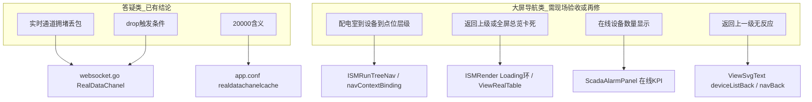
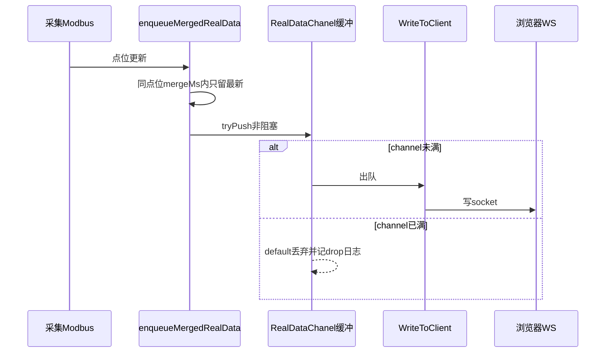

# V3.01.RC08bate 问题清单分析（2026-07-23）

依据文档：[`20260723-版本V3.01.RC08bate问题-1(1).docx`](../20260723-版本V3.01.RC08bate问题-1(1).docx)

与前序问题单 [`ISM-RC08bate-docx3-交付核对.md`](./ISM-RC08bate-docx3-交付核对.md)（docx3）高度重叠，但本单把「层级」讲清楚了：改的是**大屏画面钻探**，不是数据仓库列拆分。

Cursor Plan 副本：[`.cursor/plans/ism-rc08bate-20260723问题分析.plan.md`](../.cursor/plans/ism-rc08bate-20260723问题分析.plan.md)

---

## 总览：7 条问题分三类



| # | 原文摘要 | 类型 | 与 7/22 交付关系 | 判定 |
|---|---|---|---|---|
| 1 | 实时数据通道拥堵、溢出丢包，原因与怎么查 | 答疑+缺陷 | = docx3 A1 | **原理已写清**；须叠「根治」后端并看 `ws_realdata_drop.log` |
| 2 | drop 何时触发、内部原理 | 答疑 | = docx3 A2 | **已答**（见下） |
| 3 | 20000 是连接数吗 | 答疑（概念纠正） | = docx3 A3 | **不是连接数**，是每条 WS 的 channel 缓冲容量 |
| 4 | 大屏层级：配电室 → 设备 → 点位 | 功能需求澄清 | **新口径**（≠ 数据仓库 `_` 拆名） | **未按本口径验收**；当前钻探模型可能「房间下直接铺全量点位」 |
| 5 | 数据卡/多点设备返回上一级或全屏总览卡死转圈 | 缺陷 | ≈ docx3 B5 | 源码有 Loading 根治，**现场仍报 = 未叠前端或有回归** |
| 6 | 在线设备数量显示仍不对 | 缺陷/UI | ≈ docx3 B8（当时只去贴图） | 本单强调**数量**，可能仍是静态快照或 KPI 未覆盖到正确卡 |
| 7 | 返回上一级按钮点了没反应 | 缺陷 | 与 B5 同源导航 | `deviceListBack`/`navBack` 绑定或事件未触发 |

---

## 一、答疑类（#1–#3）：可直接给客户/现场的结论

### #1 拥堵、溢出、丢包 — 具体原因与排查

**根因（第一性）：**  
满的不是 DB，而是**每条前端 WebSocket 连接**上的 `WsConnection.RealDataChanel`。采集（含断网重连风暴）入队速度 > 该连接 `WriteToClient` 写 socket 速度 → 缓冲满 → **非阻塞丢弃**（保护进程，不阻塞采集）。

关键代码：[`ism_server_user/protocol/websocket/websocket.go`](../ism_server_user/protocol/websocket/websocket.go) 中 `tryPushChanel` / `tryPushRealDataChanel` → `noteRealDataChanelDrop`。

**二次根因（7/22 已修）：** Modbus `QueuePush` + `WSSend` 双路径，且 `WSSendAlarmOrOther` 曾绕过合并窗，入队接近双倍。见 [`ISM-RealDataChanel满根治.md`](./ISM-RealDataChanel满根治.md)。

**怎么查：**

```bash
# 1) 配置
grep -E 'realdatachanelcache|realdatapushmergems' conf/app.conf
# 期望: realdatachanelcache=20000  realdatapushmergems=2000

# 2) 运行时 drop（节流写文件，约 1 行/秒）
tail -f logs/ws_realdata_drop.log
# 字段: total / suppressed/s / project / conn / chan=len/cap / mergeMs

# 3) 判定
# - chan 长期 20000/20000 且 suppressed 持续高 → 推送仍过快或未上根治包
# - 启服 10 分钟 drop≈0，断网重连仅短时节流 → 正常
```

### #2 drop 触发条件与内部原理



**触发条件（同时满足）：**

1. 有前端连着该 `project` 的 WS（`conn≥1`）
2. 对该连接 `RealDataChanel` 执行入队时 `len(ch)==cap(ch)`
3. `select { case ch<-msg; default: drop }` 走 `default`

**不会**因为「HTTP `/getRealData` 约 5s 轮询」直接增加 drop 计数（那是另一条压力线）；drop 计数器只在 WS 通道满时加。

日志：`RealDataChanel full, drop (total=…, suppressed=…/s, project=…, conn=…, chan=…/…, mergeMs=…)`，文件 `logs/ws_realdata_drop.log`。

### #3 「20000」是什么

| 误解 | 真相 |
|---|---|
| 20000 = 最大连接数 / 设备连接数 | **否** |
| 正确含义 | **每条 WS 连接**上 `RealDataChanel` 的缓冲长度（条消息），配置项 `realdatachanelcache` |
| 配置位置 | [`ism_server_user/conf/app.conf`](../ism_server_user/conf/app.conf) `realdatachanelcache=20000` |
| 代码默认 | [`common.go`](../ism_server_user/protocol/common/common.go)：读配置失败时默认 **10000** |
| 现场值 | 补丁/`app.conf` 写成 **20000**（可改，但根治靠合并窗+单入口，不靠无限加大） |

日志里的 `conn=` 才是当前项目相关连接数；`chan=20000/20000` 表示该连接缓冲打满。

---

## 二、大屏功能类（#4–#7）：本单真正增量

### #4 层级：配电室 → 设备列表 → 单设备点位

**客户期望（本单明确）：**

```
配电室列表（如 2B2_2）
  → 该配电室下设备（2B2_U2_X01_1、2B2_U2_X01_2 …）
    → 点进某设备后才是该设备点位
```

**明确不是：** 点进配电室后，把该室下**所有设备的全部点位**平铺在一层。

**也不是：** 数据仓库里「最后一个 `_` 拆设备名/点位名」（docx3 B4，已收口）——本单写的是**画面层级**。

**现有模型参考：** [`ISM-组织层与信号层钻探模型.md`](./ISM-组织层与信号层钻探模型.md)

- 组织层：`monitor_list` 非设备节点应展示**直接 children**（`childrenList`）
- 信号层：设备节点才进测点表（`signal`）

**若现场仍「一点配电室就全是点位」**，常见原因：

1. 该节点在树里被标成设备（`type=1`），直接进 `signal`
2. 生成脚本/模板把房间页绑成「全量子树测点表」而非设备卡片列表
3. 现场跑的仍是旧 dist / 旧大屏 JSON，未含 `routeMode=childrenList` 逻辑

**落点排查：** `ISMRunTreeNav` 的 `resolveRouteMode`、`navContextBinding.js` 的 `deviceListMode` / `signalMode`，以及大屏页生成脚本是否为配电室生成「设备列表」页。

### #5 返回上一级 / 全屏总览卡死转圈

与既有「假死」同源：前端 Loading / 事件环未释放（`NavDatapointNeedHydrate` ↔ `PageUpdate`、大表 `getRealData`），不是 OceanBase 挂死。

已做：`ISMRender` / `ViewRealTable` / `ViewPagerContainer` 的 in-flight、指纹短路、约 12s watchdog（见交付核对 B5）。

**本单仍报 = 优先验证：**

1. 现场是否已叠 `ism-patch-rc08bate-docx3-*` 的 `web/dist` 并强制刷新
2. 多点设备返回时是否仍 `Maximum call stack`（浏览器控制台）
3. 「全屏总览」按钮 `labelRole=globalOverview` 是否清空 nav 上下文（[`ISMRender.vue`](../ism-front-end-v2/src/pages/ISMDisPlay/ISMRender.vue) 注释已强调返回首页须清测点上下文）

### #6 在线设备数量仍不对

docx3 B8 只修了 **KPI 背景贴图**（`ScadaAlarmPanel` `.sa-kpi { background: transparent }`），**没有保证数字正确**。

当前逻辑：[`ScadaAlarmPanel.vue`](../ism-front-end-v2/src/pages/ISMDisPlay/ScadaAlarmPanel.vue) 轮询 + WS `SystemData`，读：

- `ism.SystemData.DeviceOnLineCount`
- `ism.SystemData.DeviceCount`

若界面仍像「生成时快照」或数字离谱，需查：

1. 画布上是否还有**静态文字组件**盖住实时 KPI（生成脚本写死数字）
2. 后端 SystemData 统计是否按项目/是否含离线定义不一致
3. 覆盖层坐标 `onlineKpiStyle` 是否对不齐第 3 张 KPI 卡（盖错卡）

### #7 返回上一级没反应

按钮由 [`navContextBinding.js`](../ism-front-end-v2/src/pages/ISMDisPlay/utils/navContextBinding.js) 注入 `labelRole=deviceListBack`（文案「‹ 返回上一级」），样式在 [`ViewSvgText.vue`](../ism-front-end-v2/src/pages/ISMDisPlay/ISMComponents/standard/ViewSvgText.vue)。

「没反应」通常是：

1. 组件有样式但**点击 action / EventBus 未绑到返回栈**
2. 被上层 Loading 遮罩挡住（与 #5 叠加）
3. 当前 `navContext` 栈为空或指纹短路导致「认为无需跳转」
4. 现场页缺少 `deviceListBack` cell，点的是普通文字

---

## 三、优先级建议（若进入修复）

| 优先级 | 项 | 动作 |
|---|---|---|
| P0 | #1–#3 | **不写新代码**：整理一页客户答疑（可直接复用根治文档）；确认现场二进制含单入口合并窗 |
| P0 | #5 + #7 | 浏览器复现：钻探多点设备 → 返回 / 全屏总览；对照 console + Loading；确认 dist 版本；必要时修 `deviceListBack`/`globalOverview` 事件 |
| P1 | #4 | 按「配电室→设备→点位」验收 `resolveRouteMode` + 大屏 JSON；错则改路由/重生房间页模板，不动数据仓库 |
| P1 | #6 | 区分「贴图」与「数值」：对齐 KPI 覆盖层 + 核 SystemData；去掉静态假数字 cell |

---

## 四、与历史交付的关系（避免重复劳动）

- **答疑 #1–#3**：文档与补丁已在 7/22 收口；本单是客户/现场再次追问，交付物应是**说明 + 现场日志证据**，不是再加大 20000。
- **#5**：B5 宣称已进 dist，但冒烟写明「未做浏览器 30 次人眼钻探」——本单等于验收失败信号。
- **#4**：是本单最重要的**新澄清**；勿与 B4「`_` 拆名」混为一谈。
- **#6**：B8 只去贴图；数量问题仍开放。
- **#7**：应与 #5 同一导航回归包处理。

---

## 五、本轮落地状态（2026-07-23）

| 项 | 状态 |
|---|---|
| 分析入库（本文 + `.cursor/plans`） | 已完成 |
| #1–#3 源码/配置核对 + 客户答疑 | 已完成（见下） |
| #5/#7 导航返回与 Loading | 已修源码（见下） |
| #4 配电室→设备→点位 | 已修源码（见下） |
| #6 在线设备数值 | 已修源码（见下） |

---

## 六、实施记录

### #1–#3 RealDataChanel（答疑 + 本机核对）

| 检查项 | 结果 |
|---|---|
| `conf/app.conf` | `realdatachanelcache=20000`，`realdatapushmergems=2000` |
| 源码 | `enqueueMergedRealData` / `tryPushRealDataChanel` / `noteRealDataChanelDrop` 已在 [`websocket.go`](../ism_server_user/protocol/websocket/websocket.go) |
| 本地 `ism_server` 二进制 | 含 `enqueueMergedRealData` 与 `RealDataChanel full, drop` 字符串 |
| `logs/ws_realdata_drop.log` | 本机未启服时无文件；现场启服后 `tail -f` 观察 |

**给客户的三句话：**

1. **丢包原因**：每条前端 WebSocket 上的实时推送队列满了（不是数据库、也不是「连接数上限」）。
2. **drop 何时出现**：入队时队列已满 → 非阻塞丢弃并写 `logs/ws_realdata_drop.log`（约 1 行/秒节流）。
3. **20000 是什么**：`realdatachanelcache` = **每条连接**的队列缓冲容量（消息条数），不是最大连接数；日志里的 `conn=` 才是连接数。

完整原理见 [`ISM-RealDataChanel满根治.md`](./ISM-RealDataChanel满根治.md)。

### #5 / #7 返回上一级无反应 + 返回/总览卡死

| 根因 | 修复 |
|---|---|
| `navBack` 只识别样式、点击无处理 | [`ViewSvgText.vue`](../ism-front-end-v2/src/pages/ISMDisPlay/ISMComponents/standard/ViewSvgText.vue)：`navBack` 与 `deviceListBack` 均发 `ReturnToDeviceList`；文案匹配含「返回上一级」 |
| `deviceListReturnContext` 为空时静默 return | [`ISMRunTreeNav.vue`](../ism-front-end-v2/src/pages/ISMDisPlay/ISMRunTreeNav.vue)：无列表栈则 `onReturnToGlobalOverview` |
| `globalOverview` 缺 `homePageUuid` 直接 return | 回退 `nav.homePageUuid`；再不行发 `ReturnToGlobalOverview` |
| 进测点未带返回栈 | `onSelect` 信号路径自动从当前 `deviceListMode` nav 补 `deviceListReturnContext` |
| Loading 遮罩 | 既有 12s watchdog（[`ISM-界面切换Loading卡死根治.md`](./ISM-界面切换Loading卡死根治.md)）保留 |

### #4 配电室 → 设备 → 点位

| 根因 | 修复 |
|---|---|
| 组织进列表时递归扁平化全部子孙设备，易与「直属设备」预期不符 | `onOrgDeviceList`：**优先直属设备**；仅无直属设备时才下钻收集 |
| 配电室名被 `isLeafDeviceContainer` 当成设备 → 直进测点 | [`drillDepth.js`](../ism-front-end-v2/src/pages/ISMDisPlay/utils/drillDepth.js)：zone/room/配电室名排除 |
| 仅 1 台设备时 `resolveRouteMode` 返回 `org` 跳过列表层 | 直属全是设备时一律 `childrenList` |

### #6 在线设备数量

| 根因 | 修复 |
|---|---|
| 覆盖层偏窄，旧静态数字仍可见 | KPI 覆盖整卡数值带（x=968 w=460），实色衬底无径向贴图 |
| 字段大小写/别名漏读 | `pickSystemCount` 兼容 `Uuid/uuid`、`Value/value`、短 ID |
| `visible` 闸门导致首屏一直 `--/--` | `fetchOnlineDevices` 不再要求 `visible` |

---

## 七、现场验收清单（叠前端 dist 后）

1. 启服 10 分钟：`ws_realdata_drop.log` 无持续 `chan=20000/20000`（或仅短时节流）。
2. 总览「在线设备」显示 `在线数/总数` 数字，非长期 `--/--` 或生成时假数。
3. 点配电室（如 `2B2_2`）→ 设备列表（`2B2_U2_X01_*`）→ 再进点位；**不是**一点配电室就全是点位。
4. 多点设备页点「‹ 返回上一级」→ 回到设备列表；无列表栈时回全局总览（有反应）。
5. 「全局总览」可回首页；连续钻探/返回 20 次无永久转圈。
