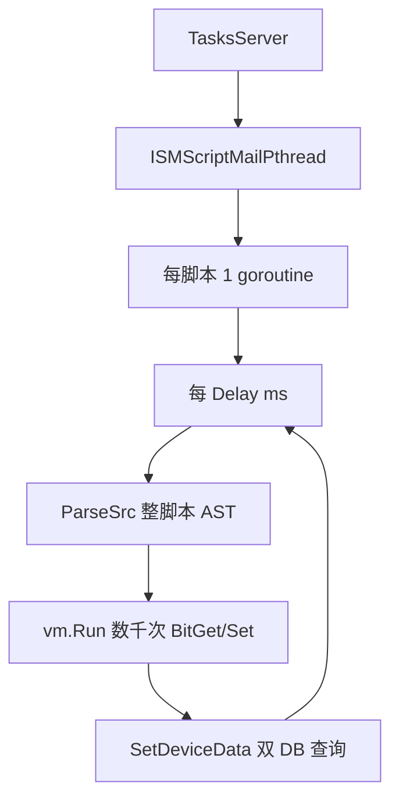
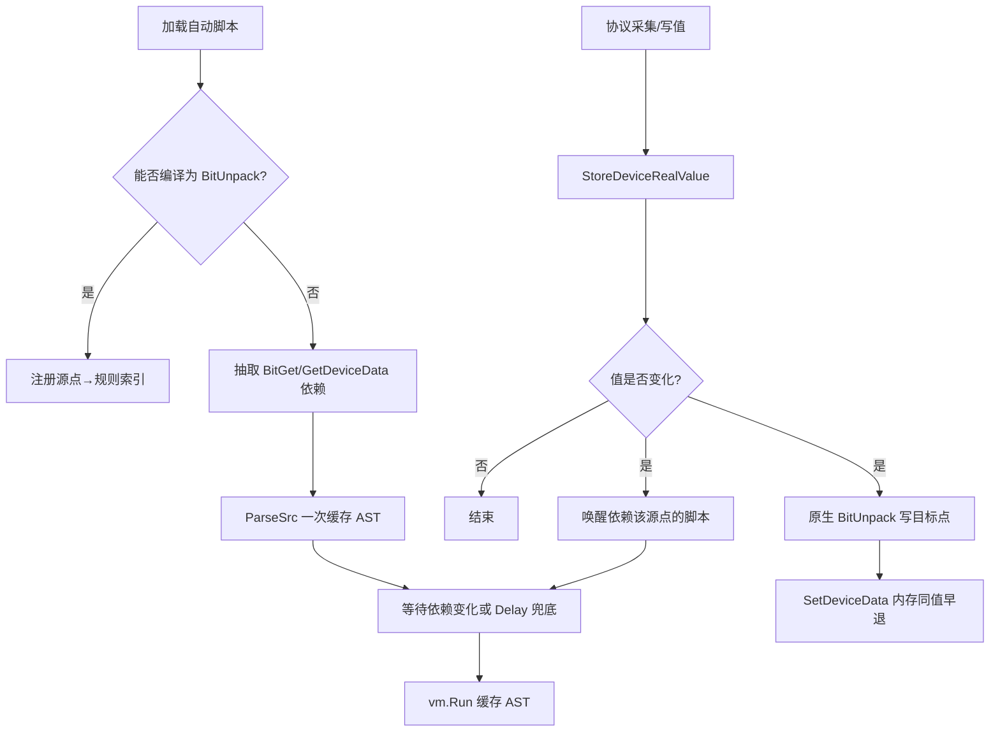

# 系统脚本 CPU 根治方案

## 结论

当前「按位解析_*」不是业务逻辑重，而是**用错了执行模型**：把纯数据变换（寄存器按位拆到虚拟点）做成「每 100ms 用 Anko 重解析 128KB 脚本 + 海量 SetDeviceData 打库」。本地约 20 条此类脚本即可形成约 **200 次/秒全量重解析**。

**根治目标**：这类脚本**不再进入 Anko 定时循环**；改为原生 Go 规则，在源点值变化时按位写出；其余自动脚本改为「依赖点变化才跑」+ AST 缓存。UI 仍可编辑原脚本，加载时自动编译分流。

## 现状机制（问题模型）

| 项 | 现状 |
|---|---|
| 引擎 | `github.com/mattn/anko`，[`ScriptDefine`](ism_server_user/protocol/commFunc/commFunc.go) |
| 调度 | [`ISMScriptMailPthread`](ism_server_user/task/ISMScript/ISMScript.go) → 每脚本 `Run` 死循环 |
| 执行 | [`ExecScript`](ism_server_user/task/ISMScript/execScript.go)：每轮新建 Env + `vm.Execute`（内部必 `ParseSrc`） |
| 现场 | 约 20×`按位解析_*`，Delay=100，单脚本 ~128KB |
| 热重载 | CRUD → `ScriptCloseChan` 全量停再起 |

## 根治架构（目标模型）

三层一起上，缺一不可：

1. **原生 BitUnpack**（消灭按位脚本的 Anko/轮询）
2. **变化驱动调度**（消灭「值没变也空跑」）
3. **SetDeviceData 快路径**（变化时写点也不打爆 DB）

## 实施设计（已选定，不再分叉）

### 1. BitUnpack 编译器（针对「按位解析」根治）

新包：`ism_server_user/task/ISMScript/bitunpack/`

- 识别**纯模式**脚本（允许空行/注释；语句仅为）：
  - `VAR = BitGet("设备->点", N)`
  - `SetDeviceData("设备->点", VAR)`（VAR 必须来自上式）
- 编译为内存规则：
  - key: `源设备->源点`
  - value: `[{Bit, TargetDevice, TargetPoint, ScriptUuid}, ...]`
- 加载成功则：**不启动该脚本的 Anko goroutine**，只挂索引。
- 无法 100% 匹配（含分支/循环/其它 API）→ 走第 2 层通用脚本路径。
- CRUD/`ScriptCloseChan` 时重建索引；日志打印「脚本 X 已原生化，规则数 Y」。

不强制新建业务表/改前端：规则运行时从现有 `ism_script` 编译；脚本仍可在 [`scriptsList.vue`](ism-front-end-v2/src/pages/ISMScripts/scriptsList.vue) 编辑。

### 2. 采集写入口挂钩（变化才干活）

改 [`StoreDeviceRealValue`](ism_server_user/protocol/common/realDataCache.go)：

- 写入前读旧值；**相等则直接返回**（可选仍 Store，但不派发）。
- 值变化时：
  1. 执行该 key 上全部 BitUnpack 规则（原生 `(val>>(bit-1))&1` → `SetDeviceData`）
  2. 通知脚本调度器：依赖含该 key 的通用脚本进入可执行队列

注意：部分协议路径可能绕过 `StoreDeviceRealValue` 只写 DB——实现时审计 Modbus/OPC/MQTT 等主路径，确保实时值最终都经此函数（已有多数调用点）；漏网路径补齐调用，避免「采集到了但不拆位」。

启动后对每个 BitUnpack 源点做**一次全量结算**（用当前缓存/DB 值跑一遍规则），避免「一直不变就不拆位」的冷启动空洞。

### 3. 通用自动脚本调度 v2

改 [`ISMScript.go`](ism_server_user/task/ISMScript/ISMScript.go) / [`execScript.go`](ism_server_user/task/ISMScript/execScript.go)：

- 启动：`ScriptDefine` 一次 + `parser.ParseSrc` 一次，循环只用 `vm.Run`。
- 依赖抽取：静态扫描脚本中的 `BitGet("a->b"` / `GetDeviceData("a->b"` 字面量，建立 `源点 → []script` 反查表。
- 执行条件（满足其一）：
  - 任一依赖点值变化（由 Store 挂钩唤醒）
  - **Delay 兜底定时**（保留，默认下限改为 1000ms；已有 Delay>1000 的尊重原值）——防止漏挂钩/无字面量依赖的脚本饿死
- `scriptWg.Add` 必须在 `go` 之前；热重载仍走 `ScriptCloseChan`。
- 手动执行 `ExecSysScript`、任务计划脚本：行为不变（同步 Execute/Run）。

### 4. SetDeviceData 快路径（共用底座）

[`deviceData.go`](ism_server_user/task/ISMScript/func/deviceData.go)：

- 入口：`LoadDeviceRealValue` 与目标值相同 → **return 0，零 DB**。
- 进程内缓存 `设备名+点名 →` 元数据（Uuid/DeviceType/告警标志等），避免每轮 `First`。
- 仅值真正变化时走 Update / 协议下发 / 告警 / 历史。

这对 BitUnpack 与残留 Anko 脚本都关键：拆位后绝大多数周期目标位不变。

### 5. 文档与运维

- [`docs/ISM-系统脚本运行机制与CPU优化.md`](docs/ISM-系统脚本运行机制与CPU优化.md)
- [`.cursor/plans/ism-系统脚本cpu优化.plan.md`](.cursor/plans/ism-系统脚本cpu优化.plan.md)
- 运维说明：升级后「按位解析_*」应出现原生化日志；CPU 应接近「无脚本」水平；若某脚本未能编译，检查是否含非纯模式语句。

## 明确范围

**做：**

- 纯 BitGet/SetDeviceData 脚本 → 原生 + 变化驱动（根治对象）
- 其它自动脚本 → AST 缓存 + 依赖变化驱动 + Delay 兜底
- SetDeviceData 同值早退/元数据缓存
- StoreDeviceRealValue 派发挂钩与冷启动结算

**不做（避免扩成新产品线）：**

- 本期不做独立「按位配置」新 UI/新表（运行时编译现有脚本即可）
- 不做换成 goja/Lua 等另一套脚本引擎
- 不删用户脚本数据（只改变执行路径）

## 验证标准（根治是否达成）

1. **CPU**：20 条按位脚本启用时，`ism_server` 空载 CPU 接近禁用这些脚本后的水平（不应再随 Delay=100 空转）。
2. **正确性**：源寄存器某 bit 0↔1 翻转时，对应目标点及时更新；未变化时无 DB Update 风暴。
3. **冷启动**：服务启动后目标位与源寄存器一致（全量结算）。
4. **编辑**：改脚本内容/禁用后热重载，原生索引与 Anko 路径都更新。
5. **兼容**：非按位复杂脚本、手动执行、协议直写 `SetDeviceData` 行为正确。
6. **日志**：能区分 `native-bitunpack` vs `anko-onchange` 两类运行实例。

## 关键文件

- [`ism_server_user/protocol/common/realDataCache.go`](ism_server_user/protocol/common/realDataCache.go) — 变化检测与派发
- [`ism_server_user/task/ISMScript/ISMScript.go`](ism_server_user/task/ISMScript/ISMScript.go) — 调度 v2
- [`ism_server_user/task/ISMScript/execScript.go`](ism_server_user/task/ISMScript/execScript.go) — AST 缓存 / 唤醒执行
- `ism_server_user/task/ISMScript/bitunpack/`（新建）— 编译与原生执行
- [`ism_server_user/task/ISMScript/func/deviceData.go`](ism_server_user/task/ISMScript/func/deviceData.go) — Set 快路径
- 协议采集主路径（按需补 `StoreDeviceRealValue`）
