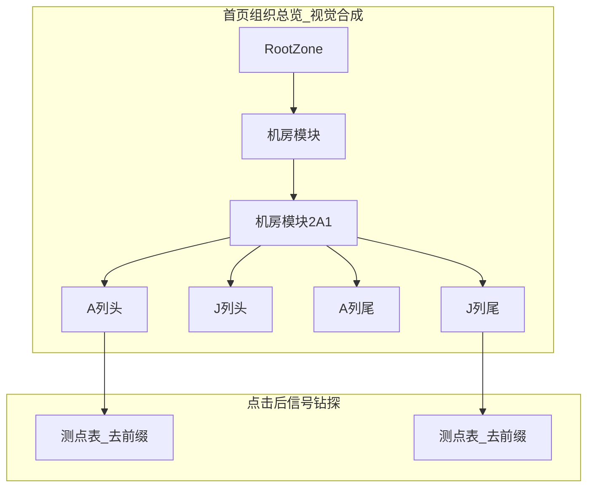

# 设备内虚拟列头柜层级方案

## 结论

**组织层 / 设备层两套层级是合理的**：库里仍是组织树；列头柜是真设备内部的虚拟子层。  
**首页组织总览要把虚拟层画出来**，树更丰满，并与左侧导航、点进后的钻探一致。

| 域 | 数据源 | 是否改库 | 展示位置 |
|---|---|---|---|
| **组织层** | `monitor_list` type=0 | 否 | 首页拓扑 / 左侧导航 |
| **设备层（真设备）** | `monitor_list` type=1 | 否 | 首页拓扑补画在末级组织下；左侧树叶节点 |
| **设备内虚拟层** | 测点名 `_` 前缀（如 `A列头`） | 否 | 首页拓扑挂在真设备下；左侧展开真设备后可见；内容区钻探 |

列头柜命名直接用测点名前缀，**不改 TA/WA**，**不拆成 20 条 monitor_list**。

### 标准样例：机房模块2A1 → 20 个虚拟列头柜

测点形如 `A列头_主路A相电压`、`J列尾_支路306A电流`。按 `_` 前一段分组后固定为：

| 系列 | 虚拟设备（共 10） |
|---|---|
| **列头** | `A列头` `B列头` `C列头` `D列头` `E列头` `F列头` `G列头` `H列头` `I列头` `J列头` |
| **列尾** | `A列尾` `B列尾` `C列尾` `D列尾` `E列尾` `F列尾` `G列尾` `H列尾` `I列尾` `J列尾` |

排序规则：先列头 A→J，再列尾 A→J。每柜约 455 测点；点进某柜后表格只显示该前缀测点，并去掉前缀（`主路A相电压`）。

同规则适用于其它多前缀机房模块（如 5A1/4A1 等）；前缀集合以该设备实际测点为准，不硬编码死 20 个，但 **2A1 验收必须出现上述 20 卡**。

触发条件：真设备测点按「第一个 `_` 前」分组后 **互异前缀 ≥ 2**；否则该设备仍直进全量测点表，首页也不挂虚拟子卡。

## 现状锚点

- 首页拓扑：[`ScadaOrgOverview.vue`](ism-front-end-v2/src/pages/ISMDisPlay/ScadaOrgOverview.vue) — 当前 `OrgNode.children` **只保留 type=0**，设备仅作计数，树偏扁
- 左侧导航：[`ISMRunTreeNav.vue`](ism-front-end-v2/src/pages/ISMDisPlay/ISMRunTreeNav.vue) — 真设备点选进测点
- 前缀过滤已有：[`navContext.js`](ism-front-end-v2/src/pages/ISMDisPlay/utils/navContext.js) 的 `filterDatapointsForDevice`、`datapointRowLabel`

## 实现方案（已选定）

### 1. 公共工具 `virtualCabinet.js`

新增 [`ism-front-end-v2/src/pages/ISMDisPlay/utils/virtualCabinet.js`](ism-front-end-v2/src/pages/ISMDisPlay/utils/virtualCabinet.js)：

- `extractPointPrefix` / `groupDatapointsByPrefix` / `shouldUseVirtualCabinetLayer`
- `buildVirtualCabinetChildNodes`（`kind: 'virtualCabinet'`）
- `ensureVirtualCabinetsForDevice(device)`：**懒加载**测点名 → 分组 → 缓存（首页/侧栏共用，避免一进首页就对 29 台各拉 9000 点）

### 2. 信号钻探（内容区）

改 `ISMRunTreeNav.onSelect` 设备分支：

1. 拉测点（缓存）
2. 多前缀 → `virtualCabinetList` + 设备列表模板（约 20 行虚拟柜）
3. 点虚拟柜 → `filterDatapointsForDevice` + `buildDeviceSignalContext`，表头/行名去前缀
4. 面包屑：`… / 机房模块2A1 / A列头`；返回回到虚拟柜列表

### 3. 首页组织总览「丰满化」（本次迭代重点）

改 [`ScadaOrgOverview.vue`](ism-front-end-v2/src/pages/ISMDisPlay/ScadaOrgOverview.vue)：

1. **末级组织下补画真设备卡**（type=1），不再只显示「N 台直属设备」数字  
   - 例：`机房模块` 下出现 `机房模块2A1`、`2A2`… 卡片
2. **真设备下挂虚拟列头柜卡**（仅多前缀设备）  
   - 样式区分：组织 / 真设备 / 虚拟柜 三套图例（脚注 legend 增加「虚拟列头柜」）
3. **懒展开**：进入首页先渲染组织 + 真设备；展开某真设备或进入视口后再 `ensureVirtualCabinetsForDevice`，挂上 `A列头`…  
   - 禁止首屏对全部机房模块并发全量测点请求
4. **点击行为**  
   - 组织卡：仍 `OpenOrgDeviceList`  
   - 真设备卡：进入虚拟柜列表（或多前缀时直接展开子卡）  
   - 虚拟柜卡：进入过滤后测点表  

统计口径：`organizationCount` 仍只计 type=0；可另显「虚拟柜数」或在 meta 中写「20 列头柜」，避免把虚拟节点算进组织节点数。

### 4. 左侧设备导航（与首页一致）

`ISMRunTreeNav` / `ISMRunTreeNode`：真设备展开时懒挂虚拟子节点（只读展示 + 可点进测点），与首页同一套 `virtualCabinet` 缓存。  
组织节点仍只来自 `getMonitorTree`，**不写回后端树**。

### 5. 明确不做

- 不改 `monitor_list`、不克隆真设备、不重导 Excel
- 不恢复 floor / 寄存器组主链路
- 虚拟柜不计入组织节点 KPI（避免和真实组织深度混淆）

### 6. 文档与验收

- 更新 [`docs/ISM-组织层与信号层钻探模型.md`](docs/ISM-组织层与信号层钻探模型.md)：信号域最多 3 层；首页拓扑合成展示
- 仓库副本：[`docs/ISM-设备内虚拟列头柜层级.md`](docs/ISM-设备内虚拟列头柜层级.md) + [`.cursor/plans/ism-设备内虚拟列头柜层级.plan.md`](.cursor/plans/ism-设备内虚拟列头柜层级.plan.md)
- 验收（以 2A1 为准）：
  1. 首页：`机房模块` → `机房模块2A1` → 依次出现 `A列头`…`J列头`、`A列尾`…`J列尾`（共 20）
  2. 点 `A列头` → 仅 `A列头_*` 测点，显示名去掉 `A列头_`
  3. 左侧导航展开同构
  4. 无多前缀设备行为不变；首页无全量测点风暴

## 关键改动文件

- 新增：`ism-front-end-v2/src/pages/ISMDisPlay/utils/virtualCabinet.js`
- 改：`ScadaOrgOverview.vue`、`ISMRunTreeNav.vue`、`ISMRunTreeNode.vue`、`navContext.js`、`navContextBinding.js`（必要时 `drillDepth.js` / `slotRemap.js`）
- 文档：`docs/ISM-组织层与信号层钻探模型.md`、`docs/ISM-设备内虚拟列头柜层级.md`、`.cursor/plans/` 副本
