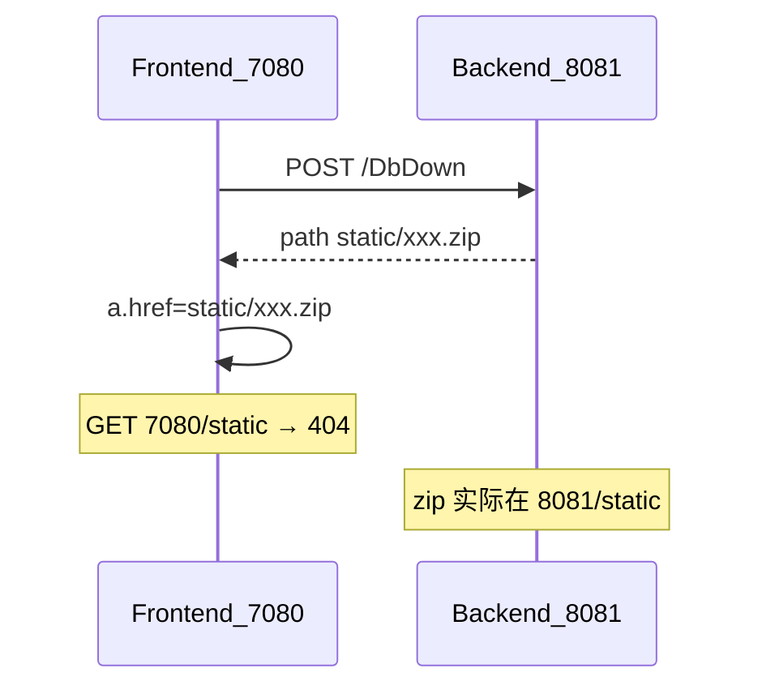

# 零界X 问题 2–7 根因分析与修复方案

> 人类可读正文与已实现说明见 [docs/ISM-零界X缺陷修复-问题2至7.md](../../docs/ISM-零界X缺陷修复-问题2至7.md)。

## 问题总览

| # | 现象 | 根因确定性 | 主因一句话 |
|---|---|---|---|
| 2 | 改参数后设备树只剩 RootZone | 高 | 懒加载树编辑后整树 `pid:0` 重载，子节点丢失 |
| 3 | Modbus Excel 导入不变 + 翻页失效 | 高 | 导出/导入列错位；受控分页缺 `total` |
| 4 | 实时告警翻页/查询/导出/清除不可用 | 中高 | loading 锁按钮 + 全量拉取；rowKey/翻页态易崩 |
| 5 | 实时数据推送有延时 | 中 | 推送队列 50ms 串行写库 + ViewRealTable 仅轮询≥1s |
| 6 | 历史入库/显示快 8 小时 | 高 | 查询用 UTC `time.Parse`，进程未固定 Asia/Shanghai |
| 7 | 实时库备份后下载 404 | 高 | 返回 `static/*.zip` 打到前端 7080，后端才有文件 |

**执行顺序（已选定）**：2 → 3 → 7 → 6 → 4 → 5（先修确定性高、用户操作立即感知的；推送延时放最后做性能优化）。

方案文档同步写入：[docs/ISM-零界X缺陷修复-问题2至7.md](docs/ISM-零界X缺陷修复-问题2至7.md) 与 [.cursor/plans/ism-零界x缺陷修复-问题2至7.plan.md](.cursor/plans/ism-零界x缺陷修复-问题2至7.plan.md)。

---

## 问题 2：设备管理树改参数后不显示设备

**根因**：[`DeviceTree.vue`](ism-front-end-v2/src/components/deviceTree/DeviceTree.vue) 默认 `treeLazy: true`；[`deviceConfig.vue`](ism-front-end-v2/src/pages/deviceLibrary/deviceConfig.vue) 编辑成功后调用 `_t.$refs.deviceTree.getMonitorTree()`，只拉根层，已展开子节点全部丢失。组件注释已描述同一模式。

**修复（选定）**：编辑成功后做**路径恢复式刷新**，不整树盲重载。

1. 在 `DeviceTree` 增加方法 `reloadKeepExpand()`：缓存 `expandedKeys` + `selectKey` → 拉根 → 按路径逐级 `onLoadTreeData` 恢复 → 再 `emit updateTree`。
2. `deviceConfig.vue` / `monitor.vue` 中 `editMonitor` 成功回调改为调用 `reloadKeepExpand()`，不再直接 `getMonitorTree()`。
3. 编辑成功后显式刷新右侧 `tableDataSource`（用当前选中节点的 `sid` 拉子列表），避免左右不同步。

---

## 问题 3：Modbus Excel 导入失效 + 翻页失效

**导入根因（列错位）**：前端导出 [`ModbusModelRegister.vue`](ism-front-end-v2/src/pages/dataModel/modbus/ModbusModelRegister.vue) 在「告警消除消息」后插入了 `报警触发值(0,1)`（`alarmOnValue`），共 19 列；后端 [`system.go`](ism_server_user/controllers/system.go) Modbus 分支仍按旧 18 列解析，`row[11]` 起全部错位，`uuid` 读到 `row[17]`（实际是「模型类型」）→ `Updates` 匹配 0 行，界面「成功但不变」。且仅调 `ModbusRegisterAddressUpdate`，无 Add，返回值未校验。

**翻页根因**：`dataPagination` / `groupPagination` 有 `current`/`pageSize`，**无 `total`**；Ant Design Vue 受控分页缺 `total` 时页码点击无效果。

**修复（选定）**：

1. **后端对齐导出列**：Modbus 导入在 `row[11]` 解析 `alarmOnValue`，后续字段顺延；`uuid` 读 `row[18]`；设置 `Muid = suuid`；uuid 存在则 Update，否则 `ModbusRegisterAddressAdd`；校验返回值。
2. **前端分页**：`registerAddressList` / `registerGroupList` 完成后设置 `total: list.length`；列表变更后同步 `total`。

---

## 问题 7：实时数据库备份后下载 404

**根因**：[`dbOpt.go` `DbDown`](ism_server_user/controllers/dbOpt.go) 返回相对路径 `static/xxx.zip`；[`DbManager.vue`](ism-front-end-v2/src/pages/db/DbManager.vue) `link.href = res.data.path` 打到前端端口；`vue.config.js` 只代理 `/api`，不代理 `/static`。

**修复（选定）**：改为 **API 流式下载**，避免与前端 `/static` 冲突。

1. 后端 `DbDown`：Zip 成功后用 `c.Ctx.Output.Download(filePath, fileName)` 直接返回文件流；失败返回 `code!=0`（当前 Zip 失败仍 `code:0`）。
2. 前端：`DbDown` 用 `responseType: 'blob'`，`URL.createObjectURL` 触发下载，不再二次跳转静态路径。

---

## 问题 6：历史数据快 8 小时

**根因**：
- 入库多用 `time.Now()`，依赖 OS/`TZ`；`main.go` 仅授权校验用 `Asia/Shanghai`，**未固定 `time.Local`**。
- [`report.go`](ism_server_user/models/report.go) 中 `GetDataHistoryList` / `GetDataHistoryReport` 用 `time.Parse`（按 UTC），同文件其他报表已用 `ParseInLocation(..., time.Local)`，语义不一致。
- TDengine 对无时区 TIMESTAMP 字面量按 UTC 解释；写入本地墙钟字符串会被当成 UTC → 显示快 8 小时。
- 前端 `new Date(ISO)` + `formatDate` 再按浏览器本地展示，易叠出 ±8h。

**修复（选定）**：

1. 进程启动统一：`time.Local = Asia/Shanghai`（`main` 最早初始化）。
2. `GetDataHistoryList` / `GetDataHistoryReport`（及同类）改为 `ParseInLocation(..., time.Local)`。
3. TDengine 写入 `FormatTDengineTimestamp`（UTC）；查询边界 `LocalWallToTDengineUTC`。
4. 前端 `parseLocalDateTime`；历史报表展示/导出统一使用。
5. 旧数据：`scripts/fix_history_record_time_minus_8h.py`（先 diagnose 再 apply）。

部署顺序：发代码 → 校正旧库 → 验新入库。容器/`launchd` 建议 `TZ=Asia/Shanghai`。

---

## 问题 4：实时告警翻页/查询/导出/一键清除

**根因（组合）**：
- [`currentAlarm.vue`](ism-front-end-v2/src/pages/alarm/currentAlarm/currentAlarm.vue)：查询/清除按钮 `:disabled="messageShowLoad"`；全量拉取时按钮长时间不可用。
- 查询成功强制 `pagination.current = 1`，翻页后点查询像「翻页无效」。
- `alarmRowKey` 已有防护，但缺 ID 且同点位多条时仍可能冲突导致 Vue 渲染异常。
- 后端 `GetCurrentAlarmList` `Limit(1000000)` 全量返回，告警多时拖垮交互。

**修复（选定，本轮做前端加固，服务端分页可二期）**：

1. 拆分 `tableLoading` 与工具栏禁用：查询加载只 spin 表格，**不禁用**导出/清除；清除用独立 `actionLoading`。
2. `alarmRowKey` 强制唯一：`ID` 优先，否则 `${duid}__${uuid}__${HappenTime}__${index}`。
3. 翻页后点查询：保留当前 `pageSize`，仅在「条件变化」时重置 `current=1`；条件未变则保持页码。
4. 一键清除后刷新：传参避免误判失败（核对 `AlarmClearAll` 与离线补建逻辑，必要时管理页传 `skipOfflineResync`）。

---

## 问题 5：实时推送延时（第二阶段）

**根因**：
- [`PthreadSendDataQueue`](ism_server_user/protocol/websocket/websocket.go)：50ms 轮询，且先 `WriteRealDataFunc` 再推 WS。
- channel `1ms` 超时丢包。
- 大屏 [`ViewRealTable.vue`](ism-front-end-v2/src/pages/ISMDisPlay/ISMComponents/standard/ViewRealTable.vue) **未订阅** `readDataPush`，仅 `setInterval ≥ 1000ms` HTTP 轮询。

**修复（选定）**：

1. **前端优先**：`ViewRealTable` 订阅 `readDataPush`，对当前页绑定点位增量更新；轮询降为 5s 兜底。
2. **后端**：`WriteRealDataFunc` 与 WS 推送解耦（先推内存值，DB 异步）；`RealDataChanel` 写满记日志，缓冲配置可调大；评估将 50ms sleep 改为批量 drain。

本阶段以「大屏可见延时下降」为验收标准；深度采集周期优化按设备 `Interval` 另评。

---

## 关键文件（按问题）

- **2**：[`DeviceTree.vue`](ism-front-end-v2/src/components/deviceTree/DeviceTree.vue)、[`deviceConfig.vue`](ism-front-end-v2/src/pages/deviceLibrary/deviceConfig.vue)
- **3**：[`system.go`](ism_server_user/controllers/system.go)、[`modbusDeviceModel.go`](ism_server_user/models/modbusDeviceModel.go)、[`ModbusModelRegister.vue`](ism-front-end-v2/src/pages/dataModel/modbus/ModbusModelRegister.vue)
- **7**：[`dbOpt.go`](ism_server_user/controllers/dbOpt.go)、[`DbManager.vue`](ism-front-end-v2/src/pages/db/DbManager.vue)、[`dbbackup.js`](ism-front-end-v2/src/services/dbbackup.js)
- **6**：[`main.go`](ism_server_user/main.go)、[`report.go`](ism_server_user/models/report.go)、历史报表相关前端格式化
- **4**：[`currentAlarm.vue`](ism-front-end-v2/src/pages/alarm/currentAlarm/currentAlarm.vue)
- **5**：[`ViewRealTable.vue`](ism-front-end-v2/src/pages/ISMDisPlay/ISMComponents/standard/ViewRealTable.vue)、[`websocket.go`](ism_server_user/protocol/websocket/websocket.go)

---

## 验收要点

1. **设备树**：展开到子设备 → 改参数保存 → 树仍展开且子设备可见，右侧表同步。
2. **Modbus**：导出改名再导入 → DB/列表名称变化；>15 条测点可翻到第 2 页。
3. **备份下载**：备份 → 点下载 → 浏览器拿到 zip，无 404。
4. **历史时区**：同一时刻对比采集时间、DB `record_time`、页面显示，三者北京时间一致（误差秒级）。
5. **实时告警**：20+ 条告警下可翻页；翻页后查询/导出/一键清除可用。
6. **实时推送**：大屏 `ViewRealTable` 在 WS `RealData` 到达后秒级内更新（不再固定卡 1s+ 轮询）。
