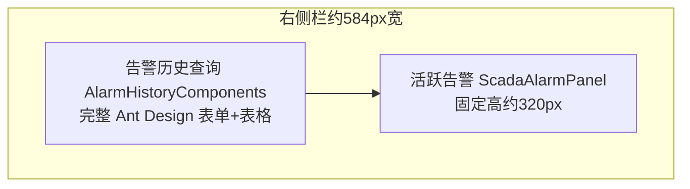

# 大屏右侧：整栏实时告警 + 历史查询抽屉

## 现状与问题

当前首页右侧由 [`build_ncc_dashboard.py`](build_ncc_dashboard.py) 的 `append_overview_side_panels` 拼成两段：

- 组态组件 [`alarmHistory.vue`](ism-front-end-v2/src/pages/ISMDisPlay/ISMComponents/device/alarmHistory.vue)（shape=`AlarmHistoryComponents`）本质是报表页：设备树、测点多选、日/周/月/自定义、表格、导出——塞进约 500px 高、侧栏宽的 foreignObject 必然「查历史空间太小」。
- 真正适合大屏盯屏的是 [`ScadaAlarmPanel.vue`](ism-front-end-v2/src/pages/ISMDisPlay/ScadaAlarmPanel.vue)（轮询 `GetCurrentAlarmList`），却被压在下方 320px。

你的判断成立：**侧栏只做实时告警；历史查询另开一层完整空间。**

## 目标交互

| 区域 | 职责 | 不做 |
|------|------|------|
| 右侧整栏 | 实时活跃告警列表、条数、启动延迟、一键清除、空态 | 不嵌设备树/日期筛选表单 |
| 「历史查询」按钮 | 打开查询层 | 不在侧栏内联展开 |
| 查询层 | 全屏宽高做筛选、翻页、导出 | 不挤占拓扑主区长期布局 |

**默认打开方式：全屏抽屉（留在大屏运行态，关抽屉立刻回盯屏）**。需要重度报表时抽屉内可再链到菜单页 `Reporting/AlarmHistory`。

## 布局改版（画布 1920×1080）

右侧外框保留；去掉 `make_alarm_history` 与「告警历史查询」标题。

- 标题改为「活跃告警」；角标可保留「● 实时监测」。
- [`ScadaAlarmPanel`](ism-front-end-v2/src/pages/ISMDisPlay/ScadaAlarmPanel.vue) 的 `panelStyle` 与脚本中 `alarm_h`/`alarm_y` **同步拉高**：覆盖原「历史 + 告警」合计高度（约从 `panel_top_y + hdr_h` 到底部），宽度仍约 `right_w - 16`。
- 列表区占满剩余高度，滚动查看；默认条数可提到 30～50（仍可本地配置）。

## 实现要点

### 1. 浮层面板（主改）

文件：[`ScadaAlarmPanel.vue`](ism-front-end-v2/src/pages/ISMDisPlay/ScadaAlarmPanel.vue)

- 调整 `panelStyle` 的 `top`/`height`（与脚本坐标一致）。
- 标题栏增加「历史查询」按钮 → `historyDrawerVisible = true`。
- 列表行高/字号按增高后的区域微调，保证可读。

### 2. 历史查询抽屉（新组件，薄封装）

新建例如 `ScadaAlarmHistoryDrawer.vue`：

- `a-drawer`（或等价全屏遮罩），`width`≈90%～100%，深色主题与大屏一致。
- 内容复用现有告警历史查询实现：优先抽/嵌 [`pages/reporting/alarmReport/alarmHistory`](ism-front-end-v2/src/pages/reporting/alarmReport/alarmHistory.vue)（完整查询+导出）；避免再往侧栏塞 `AlarmHistoryComponents`。
- 传入当前 `projectUuid`；关闭后销毁或缓存均可，以不拖垮大屏内存为准。

### 3. 大屏生成脚本

文件：[`build_ncc_dashboard.py`](build_ncc_dashboard.py) → `append_overview_side_panels`

- 删除 `make_alarm_history` 调用与历史标题。
- `alarm_h` 改为整栏可用高度；注释写明与 `ScadaAlarmPanel.panelStyle` 对齐。
- `make_alarm_history` 函数可保留（组态工具箱仍可能拖入），但首页生成不再使用。

### 4. 已部署项目落地

- 新生成/重跑脚本的项目：自动得到新布局。
- 已有库内图层：文档说明「删掉右侧 AlarmHistoryComponents + 重生」或组态编辑器手工删历史组件；浮层面板改代码发前端即可生效高度（浮层不依赖该 cell）。

### 5. 文档

同步更新：

- [`docs/ISM-RC08bate问题修复.md`](docs/ISM-RC08bate问题修复.md)
- [`docs/ISM-手工操作指南.md`](docs/ISM-手工操作指南.md) 大屏告警相关节
- 本方案副本：`docs/ISM-大屏告警区历史分离.md` + `.cursor/plans/ism-大屏告警区历史分离.plan.md`

## 验收

1. 总览页右侧整栏为活跃告警，可滚、可配条数；无挤在一起的设备树/日期控件。
2. 点「历史查询」→ 全屏抽屉，可选设备/时间、查询、翻页、导出正常。
3. 关抽屉回到大屏，轮询告警不受影响；钻探子页时面板仍按现逻辑隐藏。
4. KPI「活跃告警 / 在线设备」覆盖不受影响。

## 明确不做

- 不把 Ant Design 完整历史表单继续塞进侧栏 foreignObject。
- 不改密码链路、ISMBase 注册、ViewRealTable 等无关稳定区。
- 不强制路由跳走离开大屏（抽屉内可选链到报表页即可）。
