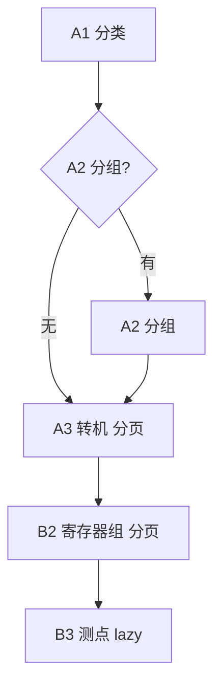

# ISM Modbus 三至五层钻探模型

> 大屏 model: `b8b4c094-faa9-a22a-1d0d-037539b27a6c`

## 两套「三层」叠加 → 实际 3~5 层（动态截断）

| 层 | modbusLayer | navContext.layer | 数据来源 | 示例 |
|----|-------------|------------------|----------|------|
| 分类 | A1 | zone | monitor_tree type=0 | UPS报警解析、配电室 |
| 分组 | A2 | room | monitor_tree type=0（可选） | 配电室_机房模块3A1 |
| 转机 | A3/B1 | gateway | monitor_list type=1 | 配电室3A1_U11 |
| 寄存器组 | B2 | registerGroup | modbus_devices_register_group | 1A1配电室-U11_AI |
| 测点 | B3 | datapoint | modbus_devices_data_model | 列尾A_主回路A相电压 |

## 路径示意



### 3 层（最短）
侧栏已定位 A3 转机（含叶容器网关）：`转机 → 寄存器组 → 测点`  
例：**数据机房报警解析**（RootZone 下无子节点，type=0 叶容器即 gateway，跳过 A1/A2 列表）

### 4 层（中间态）
- UPS：`A1 → A3×122分页 → B2 → B3`
- 配电室直连：`A1 → A3 → B2 → B3`
- 未到测点：`A1 → A2 → A3 → B2`

### 5 层（最长）
`A1 → A2 → A3 → B2 → B3`  
例：配电室 → 3A1 → 配电室3A1_U11 → AI组 → 测点

## DB 字段映射

| 概念 | 表 | 关键字段 |
|------|-----|----------|
| A1/A2 容器 | monitor_list | type=0, sid, pid, name |
| A3 转机 | monitor_list | type=1, uuid, muid, name |
| B2 寄存器组 | modbus_devices_register_group | uuid, muid, name |
| B3 测点 | modbus_devices_data_model | uuid, register_group_uuid, name |
| 实时值 | device_real_data | device_uuid, model_data_uuid |

## API

- A3 子列表：monitortree 树节点 children
- B2 列表：`POST /modbusModelRegisterGroupList` `{muid}`
- B3 列表：`POST /modbusModelRegisterList` `{uuid: registerGroupId}`
- 实时值：`POST /monitorRealData` / `getRealDataByUuid`

## 模板路由（禁用 floor 主链路）

| layer | 模板 template_kind |
|-------|-------------------|
| zone / room | zone / room |
| gateway 列表 | room（分页转机） |
| gateway → B2 | cabinet |
| registerGroup → B3 | device |

## navContext 核心字段

```js
{ layer, modbusLayer, name, uuid, sid,
  childNodes, gatewayUuid, registerGroupId,
  gatewayListMode, registerGroupListMode,
  pageIndex, pageSize, totalCount }
```

实现：`utils/drillDepth.js`（`detectDrillDepth`）+ `utils/navContext.js`
