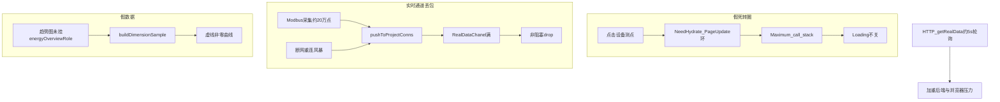

# 中航信现场可用保障 — 计划（会议 + 问题文档对齐版）

依据：
- 会议纪要（2026-07-21）：保障可用、「一锅端」平权处理；当晚方案、次日验证
- [`20260721-版本V3.01.RC08bate问题(1).docx`](20260721-版本V3.01.RC08bate问题(1).docx)
- 现场包 [`20260721.rar`](20260721.rar) + 浏览器 log + 源码结论

## 会议待办 → 本计划映射

| 会议待办 | 负责人（纪要） | 本计划落地 |
|---|---|---|
| 假死转圈 / 大屏加载卡死 | 刘彦良 | P0 事件环打断 |
| 假数据定时刷新 | 刘彦良 | P0 停用 dimension sample + 挂 energyOverviewRole |
| WS drop 根因 + 调周期 | 刘彦良 | P0 WS 队列/合并/降频 + **纠正「5 秒」误判** |
| drop 时更详细日志 | 刘彦良 | P0 诊断日志写文件（含队列长度、suppressed、项目、conn 数） |
| Logo /「循安」品牌替换 | 素材已在问题 docx | P0：从 docx 提取后改登录页/首页（见「品牌素材」） |
| 设备状态英文 | 纪要/问题文档 | P0 状态中文化 |
| 次日验证 | 邹承举 | T+1 早验收清单 |

---

## 技术结论（纠正会议中的误判）

| 议题 | 会议猜测 | 实测/源码结论 |
|---|---|---|
| 「5 秒」压力源 | 以为是 **WebSocket 发送周期** | 现场 `frontend.log` 中约 5s 一次的是 **`POST /api/getRealData` HTTP 轮询兜底**（ViewRealTable），不是 WS 发送周期。WS drop 来自 **采集推送入队速度 > 前端消费速度**，缓冲满后非阻塞丢弃。 |
| drop 触发 | 机制不明 | [`tryPushChanel`](ism_server_user/protocol/websocket/websocket.go) channel 满 → `RealDataChanel full, drop`。日志2 累计丢包约 **74.9 万**；断网重连后采集风暴必现，平时偶发。 |
| 假死主因 | 疑 OceanBase/404 | **前端** `Maximum call stack`（测点页事件环）；`getRealData` 多为 **200**，不是库挂死。404 多为 `.js.map`，非主因。 |
| 假数据 | 疑模拟程序 | 趋势图 `buildDimensionSample` + 生成脚本未挂 `energyOverviewRole`；KPI 已走真 API。 |
| 数据规模 | 约 20 万点、通讯正常 | 与「采集通、推送堵」一致；Modbus 单帧 ≤120 寄存器属采集层，非本轮假死主因（会议已同意暂搁深层采集性能）。 |

---

## 问题清单（docx + 会议合并，平权处理）

1. **品牌/UI**：首页与浏览器标签改为「循安」；左上角名称「循安电力监控平台」；去掉「ai / 临界 / 零界」等非正式文案；Logo 已从 docx 提取。
2. **设备状态英文** → 中文（在线/离线/告警等）。
3. **大屏假死转圈**：点设备进测点页长时间刷新、其它功能不可用。
4. **假数据**：电力大屏点位实为 0，定时刷成其它值。
5. **RealDataChanel 丢包**：拥堵/溢出；需可向客户解释的触发条件与缓解手段。
6. **getRealData 是否全量**：近全量风险在 `fetchAll≤5000` + 5s 轮询，非扫全项目。
7. **个别乱码 / 404**：排查期记录；`.map` 404 降噪，不挡主流程。

---

## 已落地变更（2026-07-21 热修）

### P0-A 假死转圈
- `ViewRealTable.vue`：`navPageFingerprint` / `requestNavHydrate`（3s debounce）/ 页更新短路；HTTP 轮询下限 **8s**。
- `ISMRender.vue`：`navHydrateInFlight` + 最多 3 次；空页停止 NeedHydrate↔PageUpdate 环并释放 Loading。

### P0-B 假数据
- `ViewRealDataSmoothChart.vue`：功率/能耗趋势禁 `buildDimensionSample`；无序列显示「暂无历史数据」；标题可推断 `energyOverviewRole`。
- `build_ncc_dashboard.py`：趋势图写入 `power24h` / `energyDelta24h`（现场页需重生成导入后生效）。

### P0-C WebSocket 丢包
- `websocket.go`：同点位合并窗（`RealDataPushMergeMs`，默认 **2000ms**）后再入队。
- `app.conf`：`realdatapushmergems=2000`，`realdatachanelcache=20000`。
- 诊断日志文件：`ism_server_user/logs/ws_realdata_drop.log`（字段含 total / suppressed/s / project / conn / chan len/cap / mergeMs）。**排查期默认写文件，稳定后再关。**

**客户答疑（drop 触发条件）：** 采集（含断网重连风暴）向前端 WS 的 `RealDataChanel` 推送速度超过消费速度，缓冲满后非阻塞丢弃。约 5s 一次的是 HTTP `getRealData` 轮询，不是 WS 发送周期。

**2026-07-22 根治（合并窗被旁路复发）：** 上一版 mergeMs/缓冲已生效仍可长期 `20000/20000`——Modbus 经 `GGatherDataQueue`→`WSSendAlarmOrOther` 二次直灌且无合并。现已：队列只写库、RealData 单入口必合并、写超时剔僵尸连接、高水位 latest-wins。见 [ISM-RealDataChanel满根治.md](ISM-RealDataChanel满根治.md)。

### P0-D 品牌与状态中文
- 静态资源：`ism-front-end-v2/public/static/branding/logo-xunan-hexagon.png`、`ism_server_user/static/branding/`。
- 后端 `GetAuthLicenseInfo` → `applyXunanBranding`：标签「循安」、产品名「循安电力监控平台」、公司「北京循安科技有限公司」、Logo 路径覆盖。
- 前端 `App.vue` 对「零界/zerobound」再兜底；`Login.vue` / `LoginPhone.vue` 按参考图改左品牌区 + 登录卡（**MD5 登录链路未改**）；页脚去掉 `Operated by zerobound` 英文表述。
- `pointValueDisplay.js` + 数据仓库 `monitor.vue`：`device.DeviceStatus` →「设备状态」，`0/1` → 离线/在线；常见英文状态字面量中文化。

### P1
- `navContext.js` `fetchDeviceDatapoints`：去掉 `fetchAll`，分页拉取（pageSize 100）。

### 现场部署注意
1. 替换后端二进制并保留 `conf/app.conf` 中 mergeMs / chanel cache。
2. 前端重新 `vue-cli-service serve` / 发版；确认 `/static/branding/logo-xunan-hexagon.png` 可访问。
3. 中航信大屏包若仍为旧页配置，需用更新后的 `build_ncc_dashboard.py` 重导趋势图 role。
4. 验收见下文清单；drop 明细看 `logs/ws_realdata_drop.log`。

---

## 修复方案（选定做法）

### P0-A 假死转圈（当晚必出）

文件：[`ViewRealTable.vue`](ism-front-end-v2/src/pages/ISMDisPlay/ISMComponents/standard/ViewRealTable.vue)、[`ISMRender.vue`](ism-front-end-v2/src/pages/ISMDisPlay/ISMRender.vue)

1. `NavDatapointNeedHydrate`：in-flight + 次数上限；空结果停环并释放 Loading。
2. `applySignalPageFromNav`：同一 nav 指纹不重复 hydrate。
3. `onNavDatapointPageUpdate`：uuid+页码+点位指纹短路，防 `$emit` 重入。

### P0-B 假数据（当晚必出）

文件：[`ViewRealDataSmoothChart.vue`](ism-front-end-v2/src/pages/ISMDisPlay/ISMComponents/charts/ViewRealDataSmoothChart.vue)、[`build_ncc_dashboard.py`](build_ncc_dashboard.py)

1. 停用 `buildDimensionSample` / 随机动画；无序列只显示「暂无历史数据」。
2. 趋势图挂 `power24h` / `energyDelta24h`（或修正 `detail.name` 命中 `ov-chart-*`）；现场页需重生成/补 role 后导入。

### P0-C WebSocket 丢包（当晚方案 + 可测补丁）

文件：[`websocket.go`](ism_server_user/protocol/websocket/websocket.go)、[`common.go`](ism_server_user/protocol/common/common.go) / [`app.conf`](ism_server_user/conf/app.conf)

**根因说明（写入补丁说明，供客户答疑）：**  
采集侧（含重连后）向每条前端 WS 连接的 `RealDataChanel`（缓冲默认/配置约 10000–20000）推送过快，消费（写 socket）跟不上 → 非阻塞 `drop`。与「HTTP 5 秒轮询」是两条线；5 秒轮询会加重整体负载，但不是 drop 计数器的直接触发器。

**缓解（按此顺序落地，不并行留悬念）：**
1. **合并/节流推送**：同点位短窗口只保留最新值再入队（降队列填充速率）。
2. **可配置推送最小间隔**（会议「调长周期」的正确落点）：例如默认 1s→2–5s 合并窗，稳定后再回调；**不是**把 HTTP 轮询改成 WS 周期。
3. **前端轮询**：ViewRealTable 兜底间隔不低于 5s，大屏多表时避免叠加过密（可升到 8–10s）。
4. **诊断日志**：drop 时写文件（非仅 stdout），字段含：`total/suppressed/s`、channel `len/cap`、project、conn 数、最近是否重连风暴；排查期默认开，稳定后可关。
5. 确认现场 `RealDataChanelCache=20000`；必要时清告警风暴（既有脚本）。

### P0-D 品牌与状态中文（素材已从 docx 提取，当晚同步改登录页/首页）

**素材位置（已提取）：** [`docs/assets/branding-xunan-20260721/`](docs/assets/branding-xunan-20260721/)

| docx 位置 | 文件 | 用途 |
|---|---|---|
| 「首页，左上角logo」 | `logo-xunan-hexagon.png`（原 image2） | 系统 Logo / 顶栏 / 登录卡 Logo |
| 「登录页参考」 | `login-page-reference-xunan.png`（原 image3） | 登录页目标视觉（左品牌区 + 右登录卡） |
| 现状反例 | `problem-login-lingjie-current.png`（原 image1） | 当前「零界X」登录页，需替换掉 |

**文案口径（按 docx + 参考图）：**
- 浏览器标签短名：`循安`
- 产品名：`循安电力监控平台`
- 登录页主标题（对齐参考图）：`循安科技电力监控平台`
- 英文副标：`POWER MONITORING & INTELLIGENT MANAGEMENT`
- 页脚版权：`© 北京循安科技有限公司 - 循安科技电力监控平台`

**实施落点（选定）：**
1. 将 `logo-xunan-hexagon.png` 放入前端静态资源，并更新 `SystemLogo`、`SystemAPPName`（[`App.vue`](ism-front-end-v2/src/App.vue) ← `GetSystemAuthInfo`）。
2. 按参考图改造 [`Login.vue`](ism-front-end-v2/src/pages/login/Login.vue) / [`LoginPhone.vue`](ism-front-end-v2/src/pages/login/LoginPhone.vue)：去掉「零界 / X 零界」与旧 X logo，换成循安六边形 logo + 上述标题；**不改动 MD5 密码登录链路**。
3. 首页/顶栏：[`ProjectHeader.vue`](ism-front-end-v2/src/layouts/header/ProjectHeader.vue) 用新 Logo；`document.title` 改为「循安」系。
4. 设备状态：英文 → 中文（对照 `problem-device-status-en.png`）。
5. **不再等待邹承举另发 Logo**；docx 内素材即为准。

### P1（次日验证后收尾）

1. `fetchDeviceDatapoints` 去掉 `fetchAll`；统一分页。
2. 现场跑 [`scripts/diagnose_getrealdata_timeout.sh`](scripts/diagnose_getrealdata_timeout.sh)。
3. 补丁包 + 文档同步：`docs/ISM-大屏假死与模拟数据修复.md`、`.cursor/plans/ism-大屏假死与模拟数据修复.plan.md`。

---

## 明确时间（对齐会议）

| 里程碑 | 时间 | 交付 |
|---|---|---|
| **当晚方案/热修** | **当日夜间** | P0-A/B/C 代码 + 简要说明（含 drop 触发条件答疑稿）；品牌文案能改先改 |
| **次日验证** | **次日早上** | 邹承举按验收清单测：假死、假曲线、drop 日志、文案 |
| **完整收口** | **T+3～5 工作日** | fetchAll 清理、Logo 素材合入、推送间隔按稳定性回调、日志降噪 |

验收清单（次日）：
- 连续点开 20+ 台设备测点：无栈溢出、无永久转圈
- 趋势图无 ~468 kW / ~9300 kWh 类虚线假数据；无点显示「暂无历史数据」
- 启服/断网重连后：`RealDataChanel full` 显著下降或仅节流；drop 有文件级明细
- 登录页/标签无「ai/临界」；设备状态为中文
- `getRealData` 请求带分页，无大设备 fetchAll

---

## 实施注意（防回归）

- 测点事件环与趋势图/WS 为本次范围；不顺手改 `parseRawPageLayerFields` / `applyNavContextToPageConfig`。
- 会议搁置的「Modbus 单帧/通讯管理机深层性能」本轮不做，只在文档记为后续项。
- `mergeCellDataPreserve`：空串保留旧值；数字 `0` 应覆盖。假非零优先查 sample 与 WS 陈旧值。
- 排查期保留详细 drop 日志；稳定后再关（会议明确要求）。
