# ISM Web 组态软件 · 手工操作指南

> 版本：V3.01.RC07 · 前端端口 7080 · 后端端口 8081  
> 本文档面向**手工配置**场景：从登录、建项目，到数据模型、设备管理、数据仓库、组态大屏制作与运行。  
> 截图目录：`docs/manual-screenshots/`（与本文档同仓库，可直接在 Markdown 预览中查看）。

---

## 目录

1. [整体手工流程](#1-整体手工流程)
2. [登录与项目选择](#2-登录与项目选择)
3. [数据模型（以 Modbus 为例）](#3-数据模型以-modbus-为例)
4. [设备管理](#4-设备管理)
5. [数据仓库](#5-数据仓库)
6. [应用管理与大屏制作](#6-应用管理与大屏制作)
7. [大屏运行态与多级页面](#7-大屏运行态与多级页面)
8. [地图与一次系统图组件](#8-地图与一次系统图组件)
9. [数据模型层级关系（附录）](#9-数据模型层级关系附录)

---

## 1. 整体手工流程

系统底部「项目流程」栏给出了标准顺序，**必须按此顺序操作**，否则设备无数据点、大屏无法绑点。

```
创建项目 → 创建设备模型 → 添加设备 → 组态开发 → 完成
```

| 步骤 | 菜单路径 | 产出 |
|------|----------|------|
| ① 创建项目 | `/Project` | `project_lists` 一条记录，获得 `project_uuid` |
| ② 创建设备模型 | 数据模型 → Modbus设备（或其它协议） | `devices_model` + 寄存器组 + 数据点 |
| ③ 添加设备 | 设备管理 | `monitor_list` 设备树 + 通信参数 |
| ④ 组态开发 | 应用管理 → 设计 | `display_model_layer` 各页面 cells |
| ⑤ 运行验证 | 应用管理 → 运行 / 电力监控大屏 | 实时数据、钻探、告警 |

**默认账号**：`admin` / `123456`（前端 MD5 后提交，后端 bcrypt 校验）。

---

## 2. 登录与项目选择

### 2.1 功能说明

登录页负责身份认证。管理员登录后，若存在多个项目则进入**项目列表**；若仅一个项目则直接进入首页大屏。

### 2.2 界面截图

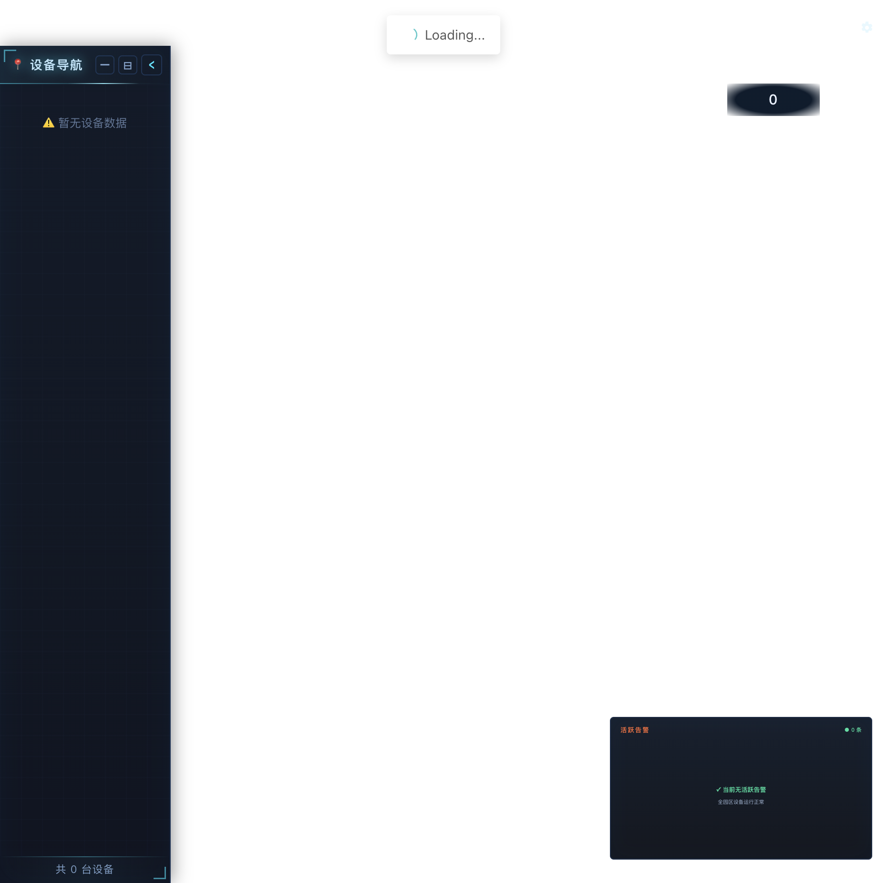

### 2.3 操作步骤

1. 浏览器访问 `http://<服务器IP>:7080/#/login`
2. 输入用户名 `admin`、密码 `123456`
3. 可选勾选「自动登录」
4. 点击「登录」

### 2.4 项目列表

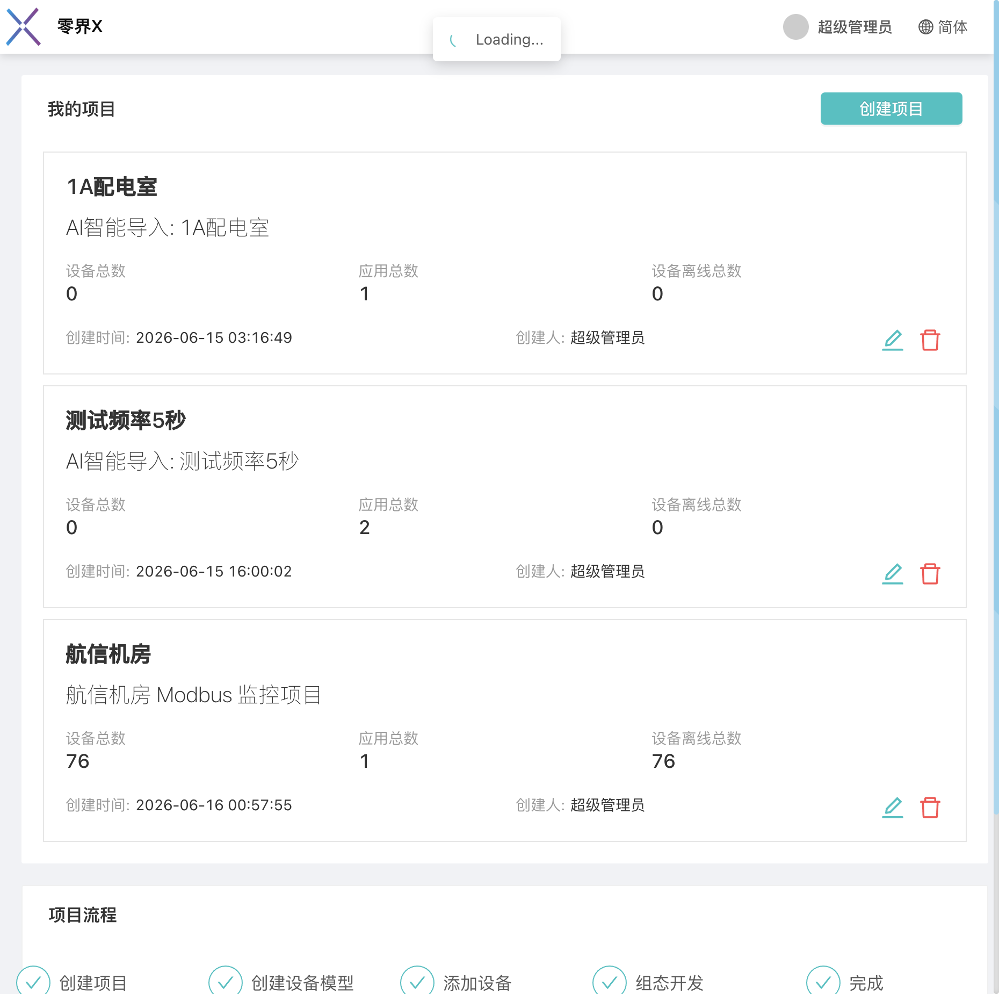

| 操作 | 步骤 |
|------|------|
| **新建项目** | 点击「创建项目」→ 填写名称、行业、描述 → 确定 |
| **进入项目** | 点击项目卡片（系统写入 `ProjectUuid` 请求头并跳转首页大屏） |
| **编辑/删除** | 卡片右下角铅笔 / 垃圾桶图标 |

**分步截图 — 创建项目弹窗**

1. 在项目列表页点击右上角「**创建项目**」
2. 在弹出的对话框中填写必填项（带 `*` 号）：

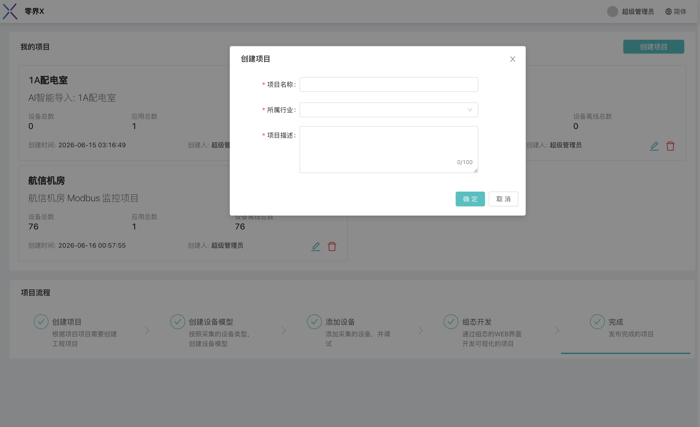

| 字段 | 说明 |
|------|------|
| 项目名称 | 工程名称，如「航信机房」 |
| 所属行业 | 下拉选择行业分类 |
| 项目描述 | 简要说明，最多 100 字 |

3. 点击「**确定**」创建；点击「**取消**」关闭弹窗

> **注意**：删除项目为物理删除，操作前请用 `python3 scripts/backup_project.py` 备份。

---

## 3. 数据模型（以 Modbus 为例）

数据模型是**模板层**：定义「这类设备有哪些寄存器/数据点、怎么连」。同一模型可挂多台物理设备。

### 3.1 核心概念

| 概念 | 数据库表 | 说明 |
|------|----------|------|
| 设备模型 | `devices_model` | 模型名称、连接方式（Serial/TCPClient/TCPServer）、超时等 |
| 寄存器组 | `modbus_devices_register_group` | 功能码 + 起始地址 + 数量，减少轮询次数 |
| 寄存器点 | `modbus_devices_data_model` | 单个测点：地址、类型、字节序、告警、历史存储 |
| 实时数据 | `device_real_data` | 设备实例化后自动生成，供大屏/WebSocket 读取 |

其它协议（SNMP、OPC UA、MQTT、S7、IEC104 等）路径在 **数据模型** 子菜单，结构类似。

### 3.2 Modbus 模型列表

**菜单**：左侧 **数据模型 → Modbus设备**

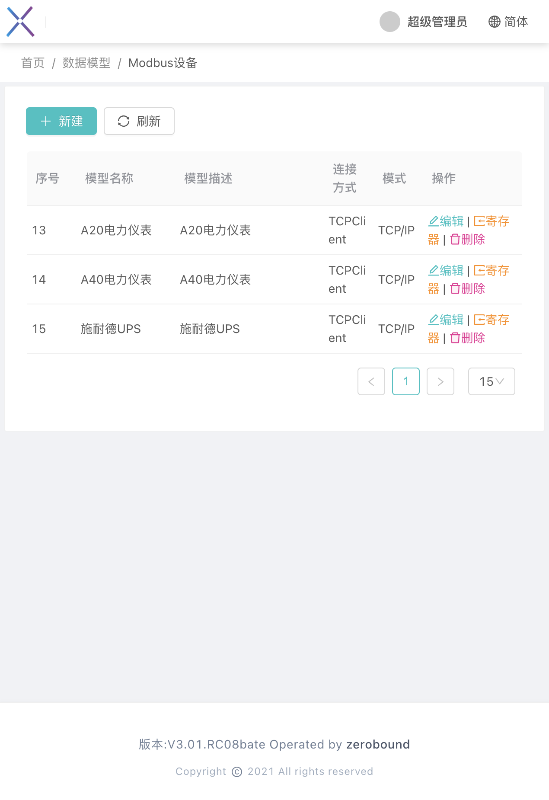

| 列 | 含义 |
|----|------|
| 模型名称 | 如 A20电力仪表、施耐德UPS |
| 连接方式 | Serial / TCPClient / TCPServer |
| 模式 | RTU / TCP/IP 等 |
| 操作 | **编辑** / **寄存器** / **删除** |

**操作步骤 — 新建模型**

1. 在模型列表页点击「**+ 新建**」→ 系统跳转到 **`/#/DeviceModel/ModbusAdd`** 全页表单（非弹窗）
2. 填写模型基本信息与通信参数（见下方截图）
3. 若选 **TCPClient**：在表单中选择 TCP 连接方式后，配置 IP、端口、从站地址等
4. 若选 **Serial**：配置 COM 口、波特率、数据位、校验位、停止位
5. 点击「**提交**」保存；点击「**返回**」回到模型列表
6. 保存后在列表中点击该模型的「**寄存器**」进入寄存器组配置

**分步截图 — 新建 Modbus 模型表单页**

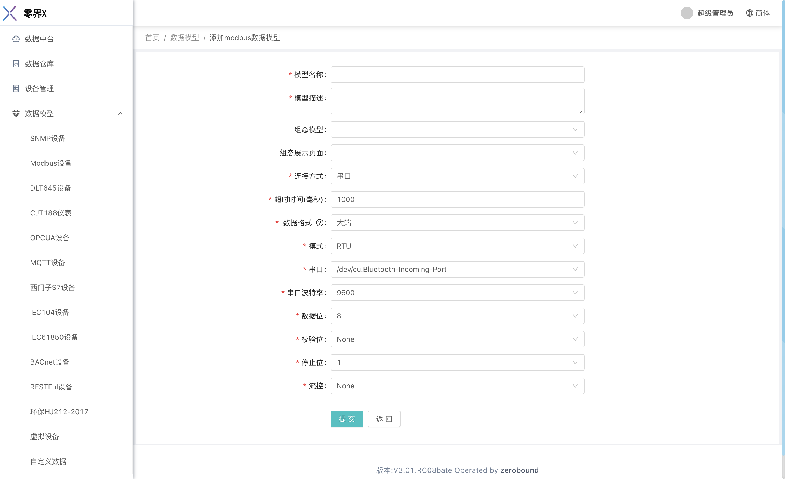

| 字段 | 说明 |
|------|------|
| 模型名称 / 模型描述 | 必填，建议与现场设备类型一致 |
| 连接方式 | Serial / TCPClient / TCPServer |
| 超时时间 | 毫秒，默认 1000 |
| 数据格式 / 模式 | 大端/小端；RTU 或 TCP/IP |
| 串口参数 | 仅 Serial 时显示：COM 口、波特率等 |

### 3.3 寄存器组配置

点击某模型的「**寄存器**」进入：

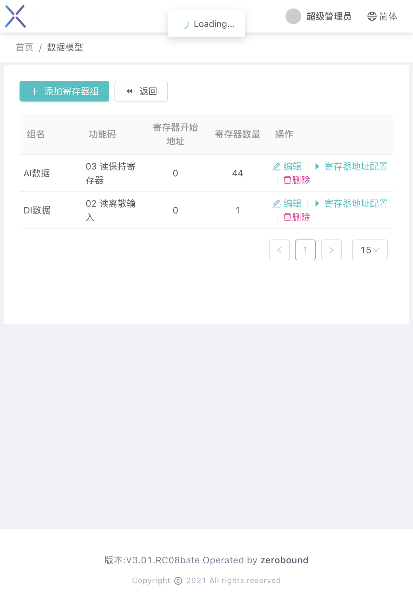

**操作步骤 — 添加寄存器组**

1. 点击「**+ 添加寄存器组**」（或工具栏同名按钮）
2. 在弹窗中填写：

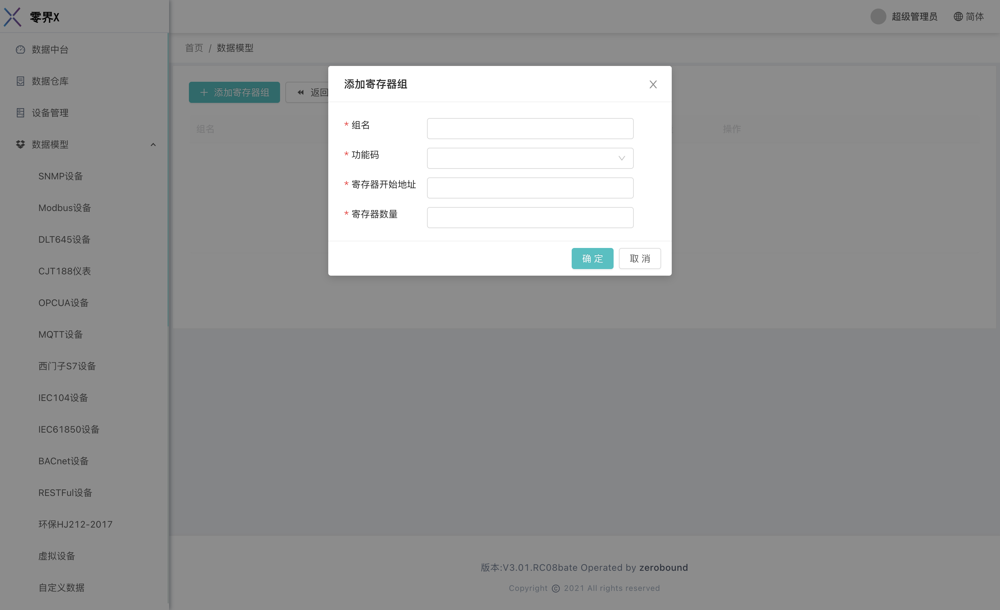

   - **组名**：如 `AI数据`、`DI数据`
   - **功能码**：03 读保持寄存器 / 02 读离散输入 等
   - **寄存器开始地址**、**寄存器数量**
3. 点击「**确定**」保存；「**取消**」关闭弹窗

**操作步骤 — 配置单个测点**

1. 在寄存器组列表（本节第一张截图）中，点击某组行的「**寄存器地址配置**」
2. 进入测点列表页，点击「**+ 添加**」为每个地址配置数据点：名称、数据类型、字节序、单位
3. 可选：转换表达式、告警上下限、是否存历史
4. 保存

> **航信机房参考**：A20 模型通常有 AI 组（44 点）+ DI 组（1 点）；UPS 模型独立一组。

### 3.4 其它协议入口（同一菜单）

| 子菜单 | 典型用途 |
|--------|----------|
| SNMP设备 | OID + MIB 导入 |
| OPCUA设备 | NodeID + 安全策略 |
| MQTT设备 | JSON 路径 Identifier |
| 西门子S7设备 | DB 块 + 偏移 |
| IEC104 / IEC61850 | 电力远动测点 |
| 虚拟设备 / 自定义数据 / 系统变量 | 计算点、静态量 |

---

## 4. 设备管理

### 4.1 功能说明

在**当前项目**下构建设备树：区域（机房/配电室/机柜）+ 设备实例。树结构保存在 `monitor_list`（`type=0` 区域，`type=1` 设备）。

### 4.2 界面截图

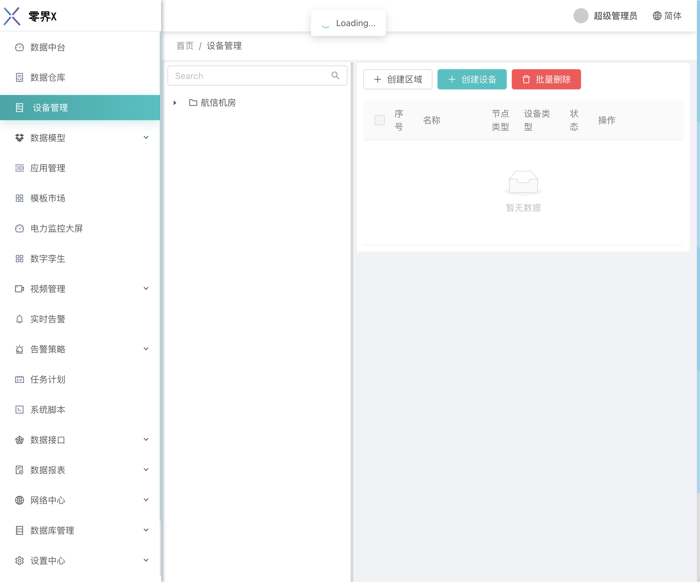

### 4.3 操作步骤

**前置**：已在「项目列表」点击进入目标项目（或手动确保请求头带 `ProjectUuid`）。

1. 菜单：**设备管理**
2. 左侧树选中父区域（如「航信机房」）
3. **创建区域**：点击「+ 创建区域」→ 右侧弹出抽屉 → 填区域名称 → 提交

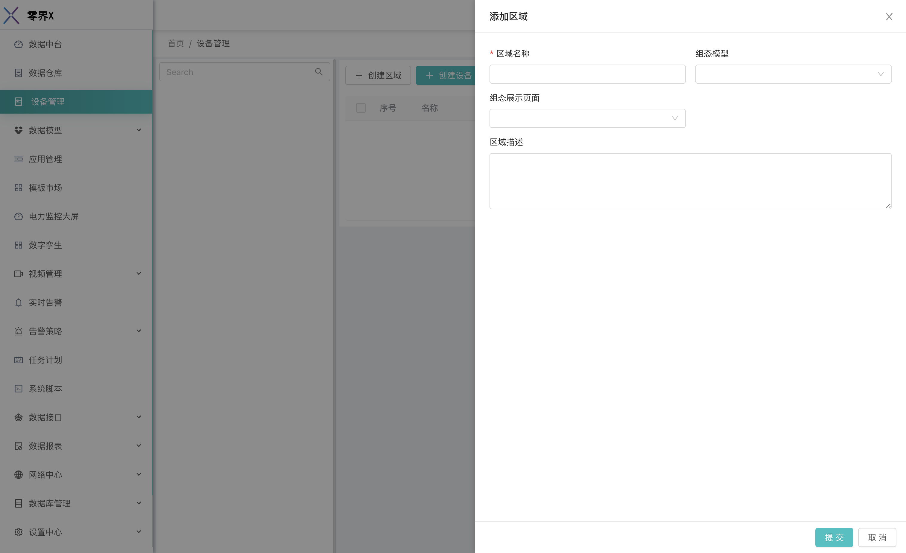

   - 典型层级：机房 → 配电室/楼层 → 机柜 → （可选）设备组

4. **创建设备**：选中区域 → 点击「+ 创建设备」→ 右侧弹出抽屉 → 填写：

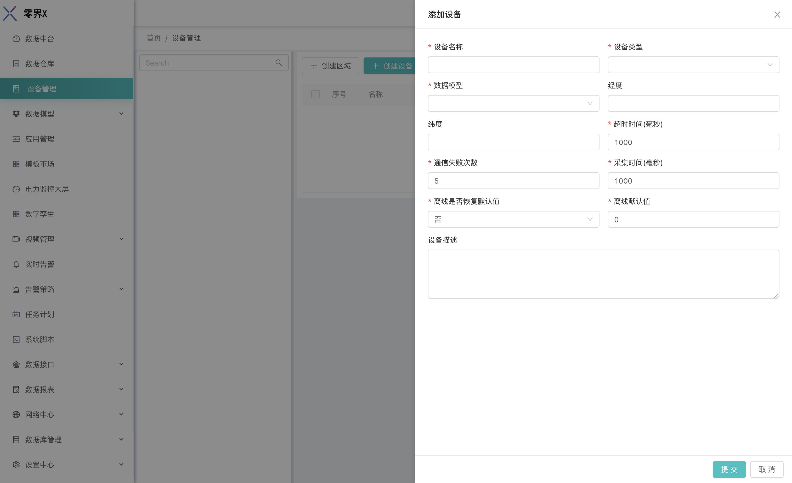

   | 字段 | 说明 |
   |------|------|
   | 设备名称 | 建议编码规则如 `1A1_U11_S18_1` |
   | 设备类型 | Modbus / SNMP 等 |
   | 数据模型 | 下拉选择第 3 章创建的模型 |
   | 超时 / 采集时间 | 毫秒级通信与轮询参数 |
   | 通信参数 | 选择 Modbus 模型后，抽屉下方会出现 IP、端口、从站 ID 等字段（TCP 模式） |

5. 点击「**提交**」保存；后端同步 `device_real_data`（实时数据点）
6. 列表可查看：名称、节点类型、设备类型、在线状态
7. **批量删除**：勾选多行 →「批量删除」

**设备启用/停用**：列表操作中可切换采集状态（对应后端 `SetDeviceStartOrStop`）。

---

## 5. 数据仓库

### 5.1 功能说明

数据仓库是**运行态读数界面**：左侧同一套设备树，右侧展示选中设备的**全部实时测点**（名称、当前值、单位、更新时间），支持搜索、下发设定值（若测点可写）。

与「设备管理」的区别：

| 模块 | 用途 |
|------|------|
| 设备管理 | 增删改设备/区域、配通信 |
| 数据仓库 | 只读/写实时值，验证采集是否正常 |

### 5.2 界面截图

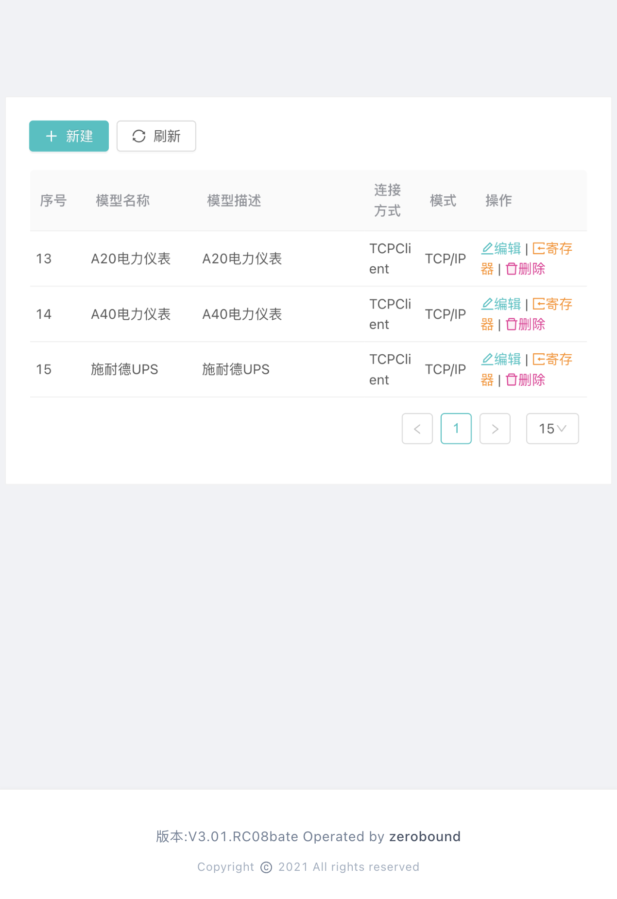

### 5.3 操作步骤

1. 菜单：**数据仓库**
2. 左侧搜索或展开树：机房 → 配电室 → 机柜 → **点击具体设备**
3. 右侧表格显示该设备所有测点实时值
4. 列头搜索框可按名称过滤
5. 对可写点：点击「设定」→ 输入目标值 → 确认（Modbus 写寄存器等）

**排障**：若值全空或不变，依次检查：设备是否启用 → 模型寄存器是否配对 → 通信 IP/端口 → 后端采集日志。

---

## 6. 应用管理与大屏制作

### 6.1 功能说明

「应用」= 一组态工程（`display_models` + 多页 `display_model_layer`）。每页是一组 JSON cells，运行时由 `AppRun` 渲染。

### 6.2 应用列表

**菜单**：**应用管理**

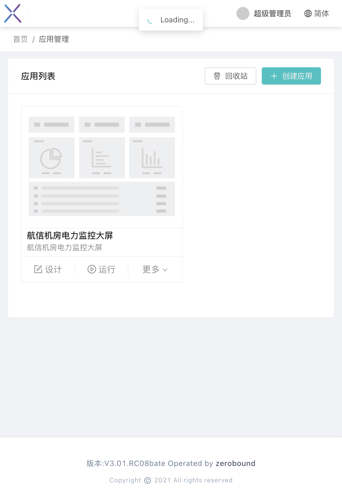

| 按钮 | 作用 |
|------|------|
| 创建应用 | 新建空白组态，获得 `display_model_uid` |
| 设计 | 打开组态编辑器 |
| 运行 | 新窗口预览运行态 |
| 更多 | 授权、分享链接、编辑信息、删除 |
| 回收站 | 恢复已软删的应用 |

**操作步骤 — 新建应用**

1. 点击「**创建应用**」
2. 填写应用名称、描述 → 确定
3. 点击「**设计**」进入编辑器

### 6.3 组态编辑器

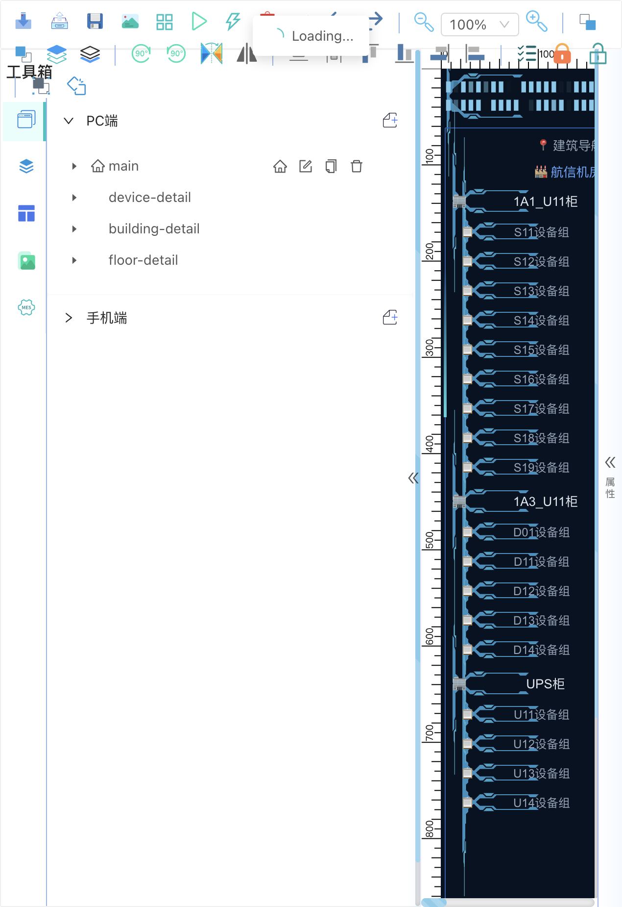

**界面分区**

| 区域 | 功能 |
|------|------|
| 顶部工具栏 | 保存、撤销/重做、对齐、预览、缩放 |
| 左侧工具箱 | 组件库：文字、图表、设备、地图、边框等 |
| 左侧页面树 | PC 端 / 手机端多页面；可设首页 |
| 中央画布 | 1920×1080（可改），拖拽摆放组件 |
| 右侧属性 | 选中组件后：样式、数据绑定、点击钻探 |

**操作步骤 — 手工做大屏（典型）**

1. **页面规划**  
   - 页面树「PC端」下：右键或 + 添加页面  
   - 设 `main` 为首页（房子图标）  
   - 可增加 `building-detail`、`floor-detail`、`device-detail` 等钻探页

2. **布局**  
   - 从工具箱拖入：边框（DvBorderBox）、标题文字（view-svg-text）、时间、KPI 数字  
   - 用标尺对齐；注意 `x + w ≤ 1920` 避免裁切

3. **绑定实时数据**  
   - 选中文字/图表 → 属性面板 → 数据 → 选择**设备 UUID + 测点**  
   - 接口：`POST /api/getRealData`，参数 `{ uuid, IsRemoveGW: false }`

4. **配置钻探（页内跳转）**  
   - 选中可点击元素 → 动作 → **click + link**  
   - 目标：`linkType: Inside`，`displayUUID` = 当前应用 ID，`pageUUID` = 目标页 ID

5. **保存**  
   - 点击顶部保存；数据写入 `display_model_layer.components`（JSON `{ cells: [...] }`）

6. **预览**  
   - 工具栏预览，或应用列表点「运行」

**首页大屏入口（可选）**  
管理员可在 **应用管理 → 应用列表 → 更多 → 设为系统首页**，将当前项目下的应用设为登录落地页与侧栏「电力监控大屏」（`#/SCADAMonitor`）的默认目标；配置持久化在后端，无需改代码。  
未设置时使用 `homeDashboard.js` 中的默认 UUID（循安电力监控）。

---

## 7. 大屏运行态与多级页面

### 7.1 功能说明

运行态路由：`/#/AppRun/<display_model_uid>`。支持：

- 左侧**设备导航树**（可折叠）
- KPI、拓扑、功率/用电趋势、设备网格
- 点击区域/机柜/设备组**逐级钻探**到子页面
- 实时告警浮层（右下角；条数可配、可滚动；「历史查询」开全屏抽屉；在线设备为实时统计）

### 7.1.1 大屏编辑与「改名后结构是否自动更新」

详见独立说明：[ISM-大屏编辑与重命名说明.md](./ISM-大屏编辑与重命名说明.md)。要点：

| 操作 | 是否自动更新结构 |
|------|------------------|
| 设备树/区域改名 | 运行态导航树会更新（来自 `monitortree`） |
| 页面 `PageName` 改名 | 只改标题，**不**重建组织层级/cells |
| 首页静态文案、写死 KPI | **不会**随改名变 |
| 正确改布局 | 用「编辑对应模板」保存模板；或重跑生成脚本 |

运行态预览 ≠ 模板编辑：预览只做 `navContext` 解析展示，不会写回模板；点「编辑对应模板」后才会改真实模板并走保存链路。

### 7.2 总览页（Level 0）

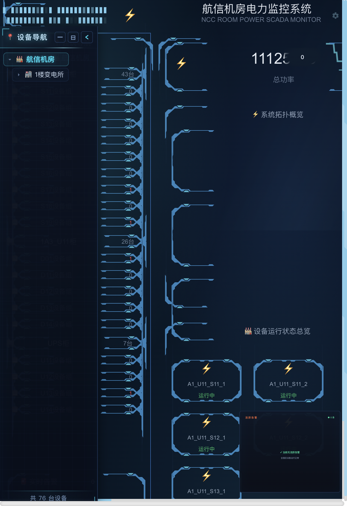

| 区域 | 功能 |
|------|------|
| 左侧导航 | 航信机房 → 1楼变电所 → 机柜 → 设备组 → 单设备 |
| 顶部 KPI | 设备总数、在线数、告警数、总功率等 |
| 系统拓扑概览 | 各机柜设备数量与状态条 |
| 设备运行状态 | 关键设备卡片 |
| 活跃告警 | 右下角告警列表（含「历史查询」抽屉入口） |
| 功率/用电趋势 | 右侧上方两个 24h 趋势图 |

**操作步骤 — 日常监控**

1. 登录后进入项目，或访问 `/#/AppRun/<UUID>`
2. 看 KPI 与告警数是否正常
3. 在拓扑或设备网格上**点击**机柜名 → 进入机柜页
4. 继续点击设备组 → 设备详情页
5. 左侧树可快速跳转任意节点
6. 管理员可从大屏「返回后台」按钮回到 `/Project`

### 7.3 各级钻探页面（设计参考）

以下为大屏各层级**设计效果图**（与 `build_ncc_dashboard.py` 生成结构一致）：

| 层级 | 页面 | 截图 | 说明 |
|------|------|------|------|
| L0 总览 | main | [design-1](manual-screenshots/design-1.png) | 全机房 KPI + 导航 |
| L1 机柜 | building-* | [design-2](manual-screenshots/design-2.png) | 单柜统计与列表 |
| L2 设备组 | floor-* | [design-3](manual-screenshots/design-3.png) | 组内设备网格 |
| L3 设备 | device-* | [design-4](manual-screenshots/design-4.png) | 单设备测点明细 |

> 手工制作时：每一级对应编辑器里的**一个 page_id**；点击动作指向对应 `pageUUID` 即可。

---

## 8. 地图与一次系统图组件

组态工具箱提供**地图**与**电力一次图**类组件，用于大屏上的空间/电气拓扑展示。

### 8.1 百度地图组件（2D/3D）

**用途**：在画布上展示地理分布、站点位置；可配合告警表做全局监控。

**设计参考**（含世界地图 + 告警横条）：


**操作步骤**

1. 组态编辑器 → 工具箱 → **地图** → 拖入「百度地图 2D」或「3D」
2. 属性：设置中心经纬度、缩放级别、样式
3. 可选：绑定设备坐标数据（自定义数据或 REST）
4. 与「实时告警列表」组件组合，实现地图 + 告警联动

### 8.2 变电所一次系统总图

**用途**：展示 10kV 母线 → 变电所 → 机房模块的**电气一次接线**总览（非 GIS 地图，是 SCADA 单线图）。

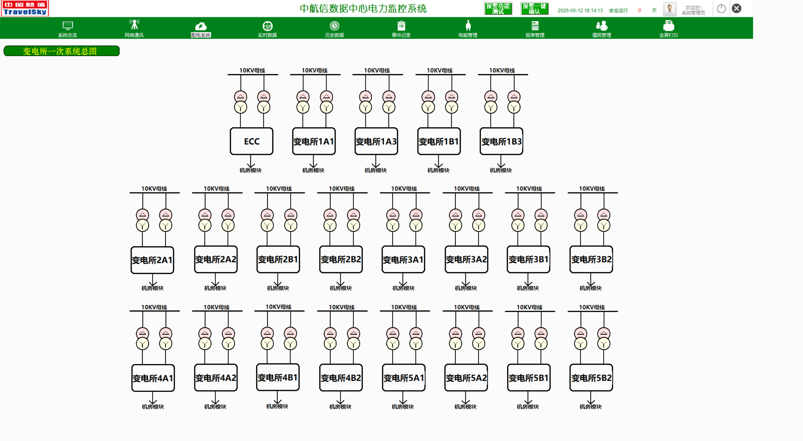

**操作步骤**

1. 准备 SVG/PNG 一次图（或使用编辑器内置电气图元 `electric_1~8` 拼搭）
2. 拖入「图片」或「SVG」组件，上传一次图
3. 在母线/开关位置叠加「文本状态」「实时数据」组件
4. 每个测点绑定对应设备的数据点 UUID
5. 为变电所块添加 **click → link** 跳转到该所详情页

### 8.3 配电系统单线图（带实时电气量）

**用途**：某一变电所（如 ECC）的详细一次图，叠加 Ia/Ib/Ic、P、PF 等。

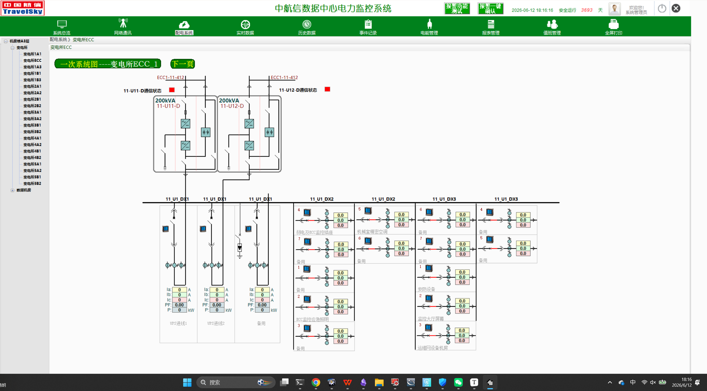

**操作步骤**

1. 新建页面，如 `substation-ecc`
2. 导入该所一次图底图
3. 按回路添加数据绑定（每个 DX 回路一组电流/功率）
4. 通信状态用「图片状态」或颜色变量：红=中断，绿=正常
5. 多页图时使用「下一页」按钮 → link 到 `substation-ecc-2`

### 8.4 组件与页面对照表

| 大屏页面类型 | 推荐组件 | 参考截图 |
|--------------|----------|----------|
| 全球/园区地图 | 百度地图 2D/3D + 告警表 | design-12.png |
| 一次系统总图 | 图片/SVG + 文本/状态 | design-1.png |
| 单所一次图 | 图片 + 实时数据文本 | design-5.png、design-7.png |
| 机柜电力监控 | 边框 + 设备网格 + 图表 | 09-dashboard-run-live.png |
| KPI 趋势 | 平滑曲线图 / 仪表盘 | design-6.png（KPI 区） |

> 相关需求（待排期）：内置电力图例扩展见 [ISM-电力一次图图例扩展需求.md](ISM-电力一次图图例扩展需求.md)。

---

## 9. 数据模型层级关系（附录）

手工配置完成后，数据库中的逻辑关系如下：

```
project_lists (项目)
    │
    ├── devices_model (协议模型模板)
    │       └── modbus_devices_register_group
    │               └── modbus_devices_data_model (测点定义)
    │
    ├── monitor_list (设备树)
    │       type=0 区域 (sid/pid 树形)
    │       type=1 设备 (muid → devices_model.uuid)
    │
    ├── device_real_data (每台设备的实时点，oid=测点uuid)
    │
    └── display_models (组态应用)
            └── display_model_layer (每页 cells JSON)
                    └── 组件绑 device_uuid + 测点 uuid
```

**数据流**：协议采集 → 更新 `device_real_data` → WebSocket 推送 → 大屏/数据仓库展示。

---

## 快速检查清单

| 检查项 | 位置 | 期望 |
|--------|------|------|
| 项目已选 | 请求头 ProjectUuid | 非空 |
| 模型有点位 | 数据模型 → 寄存器 | 组 + 地址配置完整 |
| 设备已挂载 | 设备管理树 | type=1，状态启用 |
| 有实时值 | 数据仓库 | 表格有数值、时间更新 |
| 大屏已绑点 | 编辑器属性 | 每块显示对应设备 |
| 钻探有效 | 运行态点击 | 子页面非空白 |

---

## 相关文档

- 架构笔记：`obsidian-notes/`
- 大屏变更与恢复：`docs/scada-dashboard-changelog.md`
- 启动方式：`.cursor/rules/ism-compilation.mdc`

---

*文档生成日期：2026-06-18 · 截图来自本地 dev 环境 (7080/8081)*
