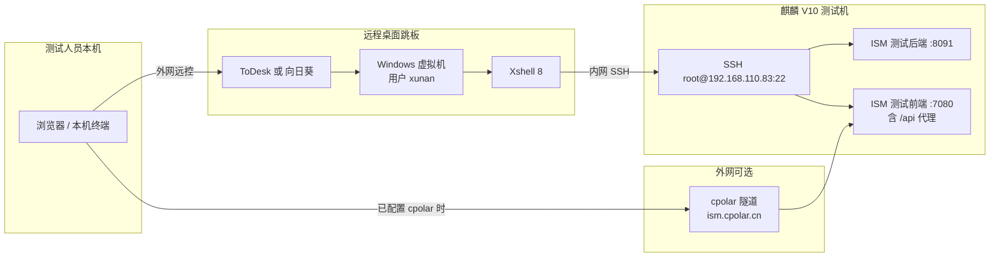

# ISM 测试环境部署指引

> ## ⚠️ 硬性隔离警告（必读）
>
> 测试部署 **必须** 使用独立目录，例如 `/opt/ism/ism-release-sqlite-YYYYMMDD/` 或 `/opt/ism/ism-test-YYYYMMDD/`。
>
> **严禁** 触碰、覆盖、依赖以下客户生产目录：
> - `/opt/ISMCode/`
> - `/opt/ISMCode/ism_web/`（电力生产）
> - `/opt/ISMCode/ism_webchaifa/`（柴发生产）
>
> 禁止从上述目录复制 `ISMServer` 或任何文件。部署包 **自包含** `ism_server_user/ism_server`。

> 适用对象：测试同事 · 非开发背景可照做  
> 软件版本：**ISM V3.01.RC07** · 部署包 `ism-release-sqlite-YYYYMMDD`（或 `ism-test-YYYYMMDD`）  
> 目标服务器：**麒麟 V10** `192.168.110.83`（经 Windows 跳板 + Xshell SSH）  
> 构建日期：2026-07-06

---

## 端口与客户生产隔离

| 归属 | 部署目录 | 前端 | 后端 | 操作 |
|------|----------|------|------|------|
| **客户电力生产** | `/opt/ISMCode/ism_web` | **7080** | **8081** | **勿动目录**；与本包同机时前端 7080 二选一 |
| **客户柴发生产** | `/opt/ISMCode/ism_webchaifa` | — | **8082** | **勿动、勿占用** |
| **历史试点（若有）** | 旧测试包 | 7080 | 8083 | 勿与本包混用 |
| **本测试包** | `/opt/ism/ism-release-sqlite-YYYYMMDD/` | **7080** | **8091** | 防火墙仅放行此二端口 |

可通过 `ports.env` 或环境变量 `ISM_FE_PORT` / `ISM_BE_PORT` 覆盖本包端口；**禁止**将后端改为 **8081/8082**。前端默认 **7080**（cpolar `largescreen` 隧道固定）。

---

## 目录

1. [整体访问链路](#1-整体访问链路)
2. [环境与账号一览](#2-环境与账号一览)
3. [部署前检查](#3-部署前检查)
4. [分步部署（推荐流程）](#4-分步部署推荐流程)
5. [启动后验证](#5-启动后验证)
6. [Modbus 与实时数据（可选）](#6-modbus-与实时数据可选)
7. [命令速查](#7-命令速查)
8. [故障排查](#8-故障排查)
9. [安全与收尾](#9-安全与收尾)
10. [附录：部署包说明](#10-附录部署包说明)
11. [cpolar 内网穿透安装](#11-cpolar-内网穿透安装)

---

## 1. 整体访问链路

测试人员通常不在机房内网，需要按下面路径逐级进入：



**两条常用访问方式：**

| 方式 | 适用场景 | 登录页地址 |
|------|----------|------------|
| 内网（经跳板） | 人在 ToDesk/向日葵 → Windows → Xshell 环境内 | `http://192.168.110.83:7080/#/login` |
| 外网 cpolar | 隧道指向本包前端 **7080** 时 | `https://largescreen.cpolar.cn` |

> **客户柴发**（与我们无关）：内网 API **8082**，目录 `/opt/ISMCode/ism_webchaifa/`，**禁止操作**。  
> **客户电力**（与我们无关）：目录勿动，API **8081**。本包 **7080 + 8091**；当前机若客户未启 ism_web 前端则 7080 无冲突。

---

## 2. 环境与账号一览

> ⚠️ 以下密码来自项目资料 PDF，**仅限测试环境**；验收后请按 [§9 安全与收尾](#9-安全与收尾) 修改。

### 2.0 macOS 本机：ToDesk 安装与首次连接

> 测试同事在 **Mac** 上先装 ToDesk，再远控 Windows 跳板。Homebrew 目前**没有** `todesk` cask，请从官网安装。

**安装**

1. 打开 [ToDesk 下载页](https://www.todesk.com/download.html)，选择 **macOS**，下载 `.pkg` 并双击安装（需输入本机管理员密码）。
2. 若命令行下载被「Security Verification」拦截，请只用浏览器下载；当前 macOS 包直链示例：`https://dl.todesk.com/macos/ToDesk_4.9.7.3.pkg`（版本号以官网为准）。
3. 安装完成后可在 **启动台** 或 Spotlight（`⌘ + 空格` 输入 `ToDesk`）打开；应用路径：`/Applications/ToDesk.app`。

**首次连接 Windows 跳板**

1. 打开 ToDesk，进入 **远程控制**（主控端）。
2. 在 **设备代码** 输入 `598659430`（界面可能显示为 `598 659 430`），**连接密码** 输入 `Wang@1234`，点击连接。
3. 进入远程桌面后，若 Windows 要求登录，使用 **`xunan` / `xunan1108`**。
4. 在 Windows 桌面打开 **Xshell 8**，再按 [§4 步骤 2](#步骤-2ssh-连接麒麟机) SSH 到 `192.168.110.83`。

**macOS 权限提示**：首次远控时系统可能要求授予 **屏幕录制**、**辅助功能** 等权限，在 **系统设置 → 隐私与安全性** 中允许 ToDesk 即可。

### 2.1 跳板：Windows 虚拟机

| 项 | 值 |
|----|-----|
| 远程软件 | **ToDesk**（也可用向日葵替代，见文末自动化评估） |
| ToDesk 设备代码 | `598 659 430` |
| ToDesk 密码 | `Wang@1234` |
| Windows 用户 | `xunan` |
| Windows 密码 | `xunan1108` |
| 用途 | 登录后使用桌面 **Xshell 8** 连接 Linux |

### 2.2 目标机：麒麟 V10（主测试机）

| 项 | 内网 | 外网（cpolar） |
|----|------|----------------|
| 地址 | `192.168.110.83` | `5.tcp.cpolar.cn` |
| SSH 端口 | `22` | **`14002`**（当前有效；旧 `8.tcp.cpolar.cn:14659` 已失效） |
| 用户 | `root` | `root` |
| 密码 | `Xunan@1108` | `Xunan@1108` |
| SSH 命令 | `ssh root@192.168.110.83` | `ssh -p 14002 root@5.tcp.cpolar.cn` |

### 2.3 备用机：CentOS 7（资料中有记录，非本包默认目标）

| 项 | 内网 | 外网 |
|----|------|------|
| 地址 | `192.168.110.11` | `31.tcp.cpolar.top` |
| SSH 端口 | `22` | `12601` |
| 用户 | `xunan` | `xunan` |
| 密码 | `Xunan@1108` | `Xunan@1108` |

### 2.4 ISM 应用

| 项 | 值 |
|----|-----|
| Web 登录（测试默认） | 用户名 **`admin`** / 密码 **`123456`** |
| 后端 API 端口（本包） | **8091** |
| 前端页面端口（本包） | **7080**（静态资源 + `/api` 反向代理到 8091） |
| 端口配置 | `ports.env` 或 `ISM_FE_PORT` / `ISM_BE_PORT` |
| 数据库 | SQLite（`dbtype=1`），包内已含循安电力监控演示库 `ism.db` |
| 部署目录 | `/opt/ism/<包名>/`（如 `/opt/ism/ism-release-sqlite-20260706/`） |

---

## 3. 部署前检查

在麒麟机上执行（Xshell 连接后）：

```bash
# 系统架构必须为 Linux x86_64（amd64）
uname -m          # 期望输出 x86_64

# 基础工具
python3 --version # 需要 Python 3（前端静态服务用）
curl --version    # 启动脚本健康检查用
unzip -v          # 解压部署包

# 磁盘空间（zip 约 1.6GB，解压后约 2.3GB+）
df -h /opt /root /home
```

| 检查项 | 要求 |
|--------|------|
| CPU 架构 | **linux/amd64**（包内 `ism_server` 为 x86_64 ELF，不能在 ARM 麒麟上直接跑） |
| 空闲磁盘 | 建议 ≥ **5GB** |
| 端口占用 | 本包 **8091**、**7080** 未被占用；**不得**占用客户 **8081/8082** |
| 防火墙 | 放行 **7080**（浏览器）、**8091**（API 调试，可选） |
| 部署包 | `ism-release-sqlite-YYYYMMDD.zip`（工作区 `releases/` 目录，约 1.7GB） |
| 客户目录 | **禁止**读写 `/opt/ISMCode/ism_web*` |

---

## 4. 分步部署（推荐流程）

### 步骤 1：进入跳板 Windows

1. 打开 **ToDesk**（或向日葵），输入设备代码 `598 659 430`，密码 `Wang@1234`。
2. 进入 Windows 后，若提示登录，使用 `xunan` / `xunan1108`。
3. 在桌面打开 **Xshell 8**。

### 步骤 2：SSH 连接麒麟机

在 Xshell 新建会话：

- 主机：`192.168.110.83`
- 端口：`22`
- 用户名：`root`
- 密码：`Xunan@1108`

连接成功后应看到麒麟 V10 的 shell 提示符。

### 步骤 3：上传部署包

部署包较大（约 **1.7GB**），任选一种方式：

**方式 A — Xshell 自带 SFTP（推荐，人在跳板时最省事）**

1. Xshell 菜单：**文件 → 传输**（或 `Alt+P` 打开 SFTP 窗格）。
2. 将本机或 Windows 上的 `ism-release-sqlite-YYYYMMDD.zip` 拖到远程目录 `/opt/ism/`。
3. 若无目录：`mkdir -p /opt/ism`

**方式 B — 从开发机经 cpolar 直传（跳过 Windows 桌面）**

若你本机可访问 cpolar 外网 SSH，可在**自己电脑**终端执行：

```bash
scp -P 14002 /path/to/ism-release-sqlite-YYYYMMDD.zip root@5.tcp.cpolar.cn:/opt/ism/
# 密码：Xunan@1108
```

> 外网 SCP 速度取决于 cpolar 带宽，大文件请预留时间。

### 步骤 4：解压

```bash
cd /opt/ism
unzip -o ism-release-sqlite-YYYYMMDD.zip
cd ism-release-sqlite-YYYYMMDD
ls -la
# 应看到 start-test.sh、ism_server_user/ism_server、web/dist/ 等
```

### 步骤 5：开放防火墙端口

麒麟 V10 一般使用 `firewalld`：

```bash
# 查看防火墙状态
systemctl status firewalld

# 放行本测试包：前端 7080、后端 8091（勿动客户 8081/8082）
firewall-cmd --permanent --add-port=7080/tcp
firewall-cmd --permanent --add-port=8091/tcp
firewall-cmd --reload

# 验证
firewall-cmd --list-ports
```

若现场未启用 firewalld，但仍有安全组/交换机 ACL，需请网管同步放行 **7080/TCP**。

### 步骤 6：处理端口冲突（如有）

```bash
# 检查本包 8091 / 7080 是否已被占用
ss -tlnp | grep -E ':8091|:7080'

# 确认客户端口（我们不应占用）
ss -tlnp | grep -E ':8081|:7080|:8082' || true

# 若 8091/7080 被占，改 ports.env 与 app.conf（后端勿改用 8081/8082）
bash stop-test.sh   # 若之前装过同目录的包
```

### 步骤 7：一键启动

```bash
cd /opt/ism/ism-release-sqlite-YYYYMMDD
bash start-test.sh
```

正常输出示例：

```
启动后端 (端口 8091) ...
启动前端静态服务 (端口 7080, /api -> 8091) ...

=== ISM 测试环境已启动 ===
  访问: http://<本机IP>:7080/#/login
  账号: admin / 123456
```

### 步骤 8：浏览器访问

- **在 Xshell 所在 Windows 上**打开浏览器：`http://192.168.110.83:7080/#/login`
- 或外网（cpolar 隧道 `addr` 须为 **7080**）：`https://largescreen.cpolar.cn`
- 登录：**admin** / **123456**

---

## 5. 启动后验证

### 5.1 进程与端口

```bash
ss -tlnp | grep -E ':8091|:7080'
cat logs/ism_server.log | tail -20
cat logs/frontend.log | tail -10
```

### 5.2 后端健康检查

```bash
curl -s -o /dev/null -w "%{http_code}\n" http://127.0.0.1:8091/
# 期望 200 或 404（能连上即可）

# 登录接口（模拟前端 MD5 后的密码）
curl -s -X POST http://127.0.0.1:8091/login \
  -H 'Content-Type: application/json' \
  -d '{"Username":"admin","password":"e10adc3949ba59abbe56e057f20f883e"}'
# 期望返回含 token 的 JSON；若提示密码错误，见 §8.3
```

### 5.3 页面功能

1. 登录后能进入项目列表。
2. 打开航信机房相关画面，组态区域不应整页空白（空白多为数据字段缺失，见 FAQ）。
3. 实时数据若全为 `--` 或离线，见 [§6 Modbus](#6-modbus-与实时数据可选)。

### 5.4 停止服务

```bash
cd /opt/ism/ism-release-sqlite-YYYYMMDD
bash stop-test.sh
```

---

## 6. Modbus 与实时数据（可选）

演示库中 Modbus 设备 IP 多为航信网段（如 `172.31.x.x`）。测试机若无真实采集器，画面上的电流、电压等可能不刷新。

| 方案 | 说明 |
|------|------|
| 接真实设备 | 将设备 IP 改到测试网段可达地址（在 ISM 后台「设备管理」中修改） |
| 本机 Modbus 模拟 | 包内 `scripts/modbus_simulator.py` **当前版本从 OceanBase 读模型**；本包为 **SQLite（dbtype=1）** 时，该脚本**不能直接使用**，需接 OceanBase 或改用现场真实设备 |
| 仅测 UI/告警/报表 | 可暂不启 Modbus，先验证登录、组态、历史功能 |

若后续切换到 OceanBase，Modbus 模拟器用法：

```bash
pip3 install pymysql
python3 scripts/modbus_simulator.py --selfcheck   # 先自检
python3 scripts/modbus_simulator.py               # 监听 0.0.0.0:502
```

并在 ISM 中将设备 IP 指向测试机地址；后端 Modbus 采集端口见 `app.conf` 中 `modbusserverport`（默认 6000 为服务端口，设备侧一般为 **502**）。

---

## 7. 命令速查

```bash
# ── 目录与启停 ──
cd /opt/ism/ism-release-sqlite-YYYYMMDD
bash start-test.sh
bash stop-test.sh

# ── 日志 ──
tail -f logs/ism_server.log
tail -f logs/frontend.log

# ── 端口 ──
ss -tlnp | grep -E ':8091|:7080'

# ── 防火墙（firewalld）──
firewall-cmd --permanent --add-port=7080/tcp
firewall-cmd --permanent --add-port=8091/tcp
firewall-cmd --reload

# ── 查占用 8091 的进程 ──
ss -tlnp | grep 8091
# 或
lsof -i :8091

# ── 登录 API 自检（admin/123456 的 MD5）──
curl -s -X POST http://127.0.0.1:8091/login \
  -H 'Content-Type: application/json' \
  -d '{"Username":"admin","password":"e10adc3949ba59abbe56e057f20f883e"}'

# ── 外网 SCP 上传（本机执行）──
scp -P 14002 ism-release-sqlite-YYYYMMDD.zip root@5.tcp.cpolar.cn:/opt/ism/
```

---

## 8. 故障排查

### 8.1 端口 8091 已被占用

**现象**：`start-test.sh` 卡住或 `logs/ism_server.log` 报 `bind: address already in use`。

```bash
ss -tlnp | grep 8091
# 记下 PID 后
kill <PID>
# 或停止旧版
bash stop-test.sh
bash start-test.sh
```

常见原因：上次未正常 `stop-test.sh`、本包端口与另一测试实例冲突。**若 8091 被客户电力 8081 占用，说明误改了 app.conf，应恢复 httpport=8091，勿动客户实例。**

### 8.2 浏览器打不开 7080

| 可能原因 | 处理 |
|----------|------|
| 防火墙未放行 | `firewall-cmd --list-ports`，补加 **7080** |
| 前端未启动 | `cat logs/frontend.log`，确认 `serve_test_frontend.py` 在跑 |
| 在错误网络访问 | 外网需 cpolar 指向 **7080**；内网需先经跳板 |
| 与客户 ism_web 抢 7080 | 停客户前端或改隧道；本包与 cpolar 须监听 **7080** |

```bash
curl -I http://127.0.0.1:7080/    # 在麒麟本机应返回 200
```

### 8.3 登录提示「密码错误」

ISM 密码链路固定：**浏览器 MD5 → 后端 bcrypt 比对**，库内存的是 `bcrypt(MD5(明文))`。

- 测试包默认：**admin / 123456**（不要改前端 MD5 逻辑）
- 若有人用 SQL 直接改了 `user` 表但未按 MD5 层加密，会导致永远登不上
- 自检命令见 [§5.2](#52-后端健康检查)

### 8.4 页面登录成功但组态区域空白

多为组态 JSON 缺少 `animate.selected` 等字段导致前端渲染崩溃。用浏览器 F12 控制台查看是否有 `Cannot read properties of undefined (reading 'includes')`。需换正确构建的 `web/dist` 或修复数据源，联系开发确认包版本。

### 8.5 `ism_server` 无法执行

```bash
file ism_server_user/ism_server
# 必须显示：ELF 64-bit ... x86-64

uname -m
# 必须是 x86_64，aarch64 不能直接运行本包
```

### 8.6 实时数据全部离线

- 设备 IP 是否可达：`ping <设备IP>`
- 本包为 SQLite 时，`modbus_simulator.py` 需 OceanBase，见 [§6](#6-modbus-与实时数据可选)
- 查看后端日志中 Modbus 相关报错：`grep -i modbus logs/ism_server.log | tail`

### 8.7 上传 zip 失败或解压不全

- 校验大小：`ls -lh ism-release-sqlite-YYYYMMDD.zip`（约 **1.6G**）
- 重新 unzip：`unzip -t ism-release-sqlite-YYYYMMDD.zip` 测试完整性
- 磁盘满：`df -h`

---

## 9. 安全与收尾

测试验收后建议至少完成：

| 项 | 建议 |
|----|------|
| ISM `admin` 密码 | 在系统内「用户管理」修改；**不要**只改数据库明文 |
| Linux `root` 密码 | 修改 `Xunan@1108` |
| Windows / ToDesk | 修改跳板密码 |
| cpolar 隧道 | 评估是否对公网暴露，必要时加访问控制 |
| 演示数据 | 含航信机房演示库，勿用于生产 |

---

## 10. 附录：部署包说明

### 10.1 目录结构

```
ism-release-sqlite-YYYYMMDD/
├── start-test.sh              # 一键启动
├── stop-test.sh               # 停止服务
├── README-部署说明.md
├── BUILD_INFO.txt
├── ism_server_user/
│   ├── ism_server             # Linux amd64 后端（包内自包含，禁止从 ism_web 复制）
│   ├── conf/app.conf          # dbtype=1, httpport=8091
│   ├── ports.env              # ISM_FE_PORT=7080, ISM_BE_PORT=8091
│   ├── data/db/ism.db         # SQLite 循安电力监控演示库
│   └── static/
├── web/dist/                  # 前端生产构建（约 1.5GB）
└── scripts/
    ├── serve_test_frontend.py # :7080 静态 + /api → :8091
    └── modbus_simulator.py    # 需 OceanBase（见 §6）
```

### 10.2 与资料 PDF 的 URL 对应

| 归属 | 内网 | 外网 |
|------|------|------|
| **客户电力**（勿动） | :7080（页） / :8081（API） | `https://ism.cpolar.cn` |
| **客户柴发**（勿动） | :8082 | `https://ism-chaifa.cpolar.cn` |
| **本测试包** | :7080（页） / :8091（API） | `https://largescreen.cpolar.cn` |

> 柴发实例位于 `/opt/ISMCode/ism_webchaifa/`，与本测试包完全隔离，**禁止操作**。

### 10.3 生产环境建议

- 使用 **Nginx** 托管 `web/dist`，`location /api { proxy_pass http://127.0.0.1:8091; }`
- 大库迁移与 OceanBase 见：`docs/ISM-OceanBase部署与切换指南.md`

---

## 11. cpolar 内网穿透安装

> 适用：**麒麟 V10**（x86_64，systemd，类 CentOS/RHEL）  
> 官方文档：<https://www.cpolar.com/docs>  
> 当前测试机 SSH 隧道为 **`5.tcp.cpolar.cn:14002`**（旧 `8.tcp.cpolar.cn:14659` 已失效）。Web 见 `https://ism-test.cpolar.cn`。**先检查，勿重复安装。**

### 11.1 检查是否已安装（在 192.168.110.83 上执行）

```bash
# 1) 客户端是否在 PATH
which cpolar
cpolar version

# 2) systemd 服务
systemctl status cpolar
systemctl is-enabled cpolar

# 3) 配置文件与进程
ls -la /usr/local/bin/cpolar /usr/local/etc/cpolar/cpolar.yml 2>/dev/null
cat /usr/local/etc/cpolar/cpolar.yml    # 查看 authtoken、隧道定义（勿外传 token）

# 4) Web 管理界面（默认 9200，仅本机/内网）
ss -tlnp | grep 9200
curl -s -o /dev/null -w "%{http_code}\n" http://127.0.0.1:9200/

# 5) 隧道是否在线（登录 https://dashboard.cpolar.com/status 对照）
# 期望：TCP 5.tcp.cpolar.cn:14002、HTTP ism-test.cpolar.cn
```

| 现象 | 含义 |
|------|------|
| `which cpolar` 有输出且 `cpolar version` 正常 | 已安装客户端 |
| `systemctl status cpolar` 为 `active (running)` | 服务在跑，一般已开机自启 |
| `cpolar.yml` 含 `remote_addr: 5.tcp.cpolar.cn:14002` 等 | SSH 固定 TCP 已配置 |
| `subdomain: ism` 或后台状态页有 `ism.cpolar.cn` | HTTP 隧道已配置 |

**若已全部正常**：跳过 §11.2，仅需 `systemctl restart cpolar` 改配置后重启；外网验证见 §11.5。

**若服务异常**：`journalctl -u cpolar -n 50 --no-pager` 查日志；常见原因为 authtoken 失效或未登录。

### 11.2 全新安装（一键脚本，官方推荐）

麒麟 V10 与 CentOS 7/8+ 类似，脚本会自动识别 **amd64** 并配置 systemd。

```bash
# 0) 确认架构（须 x86_64）
uname -m

# 1) 依赖（无 curl 时）
yum install -y curl

# 2) 国内一键安装（官方脚本）
curl -L https://www.cpolar.com/static/downloads/install-release-cpolar.sh | sudo bash

# 3) 验证安装
cpolar version
# 期望：/usr/local/bin/cpolar，配置文件 /usr/local/etc/cpolar/cpolar.yml
```

国外网络可用短链：`curl -sL https://git.io/cpolar | sudo bash`

卸载（如需重装）：`curl -L https://www.cpolar.com/static/downloads/install-release-cpolar.sh | sudo bash -s -- --remove`

### 11.3 注册与 authtoken（勿使用他人 token）

1. 打开 <https://www.cpolar.com> 注册并登录。
2. 左侧 **「验证」**（或仪表盘 **「连接您的账户」**）复制 **authtoken**（每人不同，勿提交到 Git）。
3. 在麒麟机上执行（将 `YOUR_AUTHTOKEN` 替换为官网复制的值）：

```bash
cpolar authtoken YOUR_AUTHTOKEN
# 写入 /usr/local/etc/cpolar/cpolar.yml 的 authtoken 字段
```

### 11.4 配置隧道

两种方式任选：**Web UI**（`http://127.0.0.1:9200`，用 cpolar 账号登录）或 **编辑配置文件**（推荐可重复、便于备份）。

#### 11.4.1 在 cpolar 官网预留固定地址（与资料 PDF 对齐时）

| 类型 | 后台路径 | 资料中的值 |
|------|----------|------------|
| 保留 TCP（SSH） | 预留 → 保留 TCP 地址 | `5.tcp.cpolar.cn:14002` |
| 保留二级子域名（HTTP） | 预留 → 保留二级子域名 | `ism` → `ism.cpolar.cn` |

> 固定 TCP / 二级子域名通常需 **基础套餐及以上**；免费版多为随机地址（24–48 小时变化）。

#### 11.4.2 配置文件示例（SSH 22 + ISM 测试前端 7080）

```bash
cp /usr/local/etc/cpolar/cpolar.yml /usr/local/etc/cpolar/cpolar.yml.bak.$(date +%F)
vi /usr/local/etc/cpolar/cpolar.yml
```

示例内容（**YAML 缩进用空格，不要用 Tab**；token 与地址以你账号后台为准）：

```yaml
authtoken: YOUR_AUTHTOKEN

tunnels:
  ssh:
    addr: 22
    proto: tcp
    region: cn_vip
    remote_addr: 5.tcp.cpolar.cn:14002

  ism-test-web:
    addr: 7080
    proto: http
    region: cn_vip
    subdomain: largescreen
```

说明：

- **ssh**：本地 22 → 外网 `5.tcp.cpolar.cn:14002`（`remote_addr` 须与后台「保留 TCP」一致）。
- **ism-test-web**：本地 **7080**（本测试包前端）→ `https://largescreen.cpolar.cn`（须先在后台保留子域名）。
- **勿**将隧道指向客户 7080，以免与 `/opt/ISMCode/ism_web` 冲突。
- 若暂未购买固定地址，可删掉 `remote_addr` / `subdomain`，启动后从 <https://dashboard.cpolar.com/status> 查看临时公网地址。

#### 11.4.3 开机自启并启动服务

```bash
sudo systemctl enable cpolar
sudo systemctl start cpolar
sudo systemctl status cpolar
sudo systemctl restart cpolar    # 修改 cpolar.yml 后执行
```

常用：`systemctl stop cpolar` / `systemctl restart cpolar` / `journalctl -u cpolar -f`

#### 11.4.4 防火墙（Web UI 9200，可选）

仅本机配置隧道时需要；外网访问本测试包走 cpolar，**不必**对公网开放 7080。

```bash
firewall-cmd --permanent --add-port=9200/tcp
firewall-cmd --reload
```

### 11.5 外网验证

在**测试人员本机**（不在 192.168.110.83 内网时）执行：

```bash
# SSH（资料中的外网入口）
ssh -p 14002 root@5.tcp.cpolar.cn
# 密码：Xunan@1108（测试环境，见 §2.2）

# 浏览器
# https://ism.cpolar.cn
# 或临时隧道时打开 dashboard 状态页显示的 https 地址
# 登录 ISM：admin / 123456

# HTTP 探测（可选）
curl -I https://ism.cpolar.cn
curl -s -o /dev/null -w "%{http_code}\n" https://ism.cpolar.cn
```

在麒麟机本机确认隧道与 ISM 已启动：

```bash
systemctl status cpolar
ss -tlnp | grep -E ':22|:7080|:9200'
curl -I http://127.0.0.1:7080/
```

### 11.6 故障排查

| 现象 | 处理 |
|------|------|
| `cpolar: command not found` | 未安装或 PATH 无 `/usr/local/bin`，见 §11.2 |
| `systemctl status` 失败 | `journalctl -u cpolar -n 100`；检查 yml 缩进、authtoken |
| 外网 SSH 连不上 | 确认 `remote_addr` 与后台 TCP 一致；本机 `sshd` 在 22 监听 |
| `largescreen.cpolar.cn` 打不开 | 确认 ISM 已 `bash start-test.sh`；隧道 `addr: 7080`；子域名已在后台保留 |
| 隧道频繁变地址 | 免费版特性；升级套餐并在 yml 中配置 `remote_addr` / `subdomain` |

---

*文档更新日期：2026-07-06 · 基于 `docs/ISM相关信息.pdf` 与 `releases/ism-release-sqlite-YYYYMMDD` 部署包*
