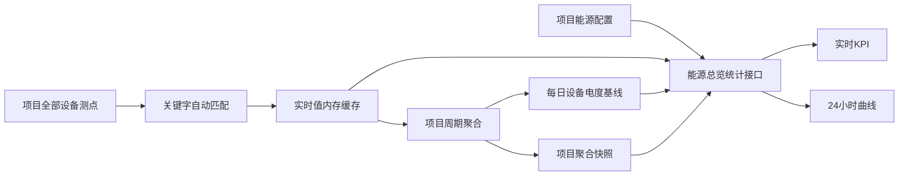

# ISM 首页能源真实统计

## 目标

首页能源指标只展示现场真实数据。系统按关键字自动发现项目内所有设备的四类能源测点，无需逐台配置：

- 总有功功率、总无功功率、总视在功率：按角色**独立**汇总（有功不必再要求无功/视在齐套才计入）。
- 设备匹配：至少匹配到一类能源角色即可入选；不再要求四测点全部齐套。
- 今日用电量：逐设备计算当前累计正有功电度减去午夜基线，再汇总有效增量。
- 24 小时功率曲线：按时间桶计算三类功率平均值。
- 24 小时用电量曲线：按相邻时间桶累计电度的差值计算分时用电量。

没有配置、实时值为空、午夜基线缺失或历史数据不足时，接口返回明确的数据状态，前端显示空态，不生成示例数据。

## 数据链路

## 配置口径

每个项目保存以下配置：

- 总有功功率、总无功功率、总视在功率、正有功电度的关键字列表；
- 历史采样间隔，允许 60～300 秒；
- 趋势聚合桶，允许 1～5 分钟。

默认关键字分别为 `总有功功率|有功功率`、`总无功功率|无功功率`、`总视在功率|视在功率`、`正有功电度|正向有功电能`。完全匹配优先于包含匹配；同优先级出现多个候选时标记为歧义并排除，避免任意取值。

配置入口位于“系统参数 → 能源总览”。相关接口均以 `ProjectUuid` 请求头隔离项目：

- `GetEnergyOverviewCandidates`：返回总设备数、完整匹配数、缺失/歧义数和少量异常示例，不返回设备全集；
- `GetEnergyOverviewConfig`：读取当前项目配置；
- `SaveEnergyOverviewConfig`：保存配置并启用历史记录；
- `GetEnergyOverviewStats`：返回实时值、今日用电量和 24 小时时间桶序列。

接口统一使用 `{ "code": 0, "result": ... }` 响应。统计结果同时返回 `eligibleDevices`、`validDevices`、`missingDevices`、`ambiguousDevices` 和 `resetDevices`，用于明确部分汇总的覆盖率。

## 计算规则

周期任务先逐设备校验实时值，再写入一条项目级聚合快照。功率曲线对统计桶内的项目快照取平均；用电量曲线汇总各设备相邻采样间的非负累计电度差。负差视为电表回零或异常并计入 `resetDevices`。

### 防重复 / 防脏数据

- **每台设备每个角色只取一个测点**（完全匹配优先；同优先级多个候选记为歧义并排除，不会把三相+总加在一起）。
- **只统计 `is_enable=1` 的设备**。停用设备不再采集，但其 `device_real_data` 可能残留天文数字；若仍参与求和会出现「总功率数亿 kW」。
- **单台功率绝对值 > 1e6 kW 视为非法**，不计入总功率（常见于寄存器换算未生效或错点）。
- **不做父子层级二次加总**：树上级与下级若都有「总有功功率」会重复；当前按设备扁平汇总，需靠关键字/歧义排除保证只留边界表计。现场应避免「进线总表 + 全部馈线」同时入选。

今日用电量必须存在今日 00:00 前的有效基线。首日尚未形成基线时返回空值，不以首条日内数据冒充零点值。

聚合快照和每日基线存放在主配置数据库中。即使项目有上万设备，24 小时接口也只读取最多约 1440 条项目快照，不加载数千万条设备原始历史。

## 前端约束

首页四个能源组件通过 `energyOverviewRole` 声明数据角色，不再绑定“项目第一台有值设备”。系统参数页只配置关键字和采样参数，并展示自动匹配覆盖率；部分数据状态会在 KPI 提示和曲线提示中明确标识。

能源总览模式禁止启用硬编码示例曲线和随机动画。
