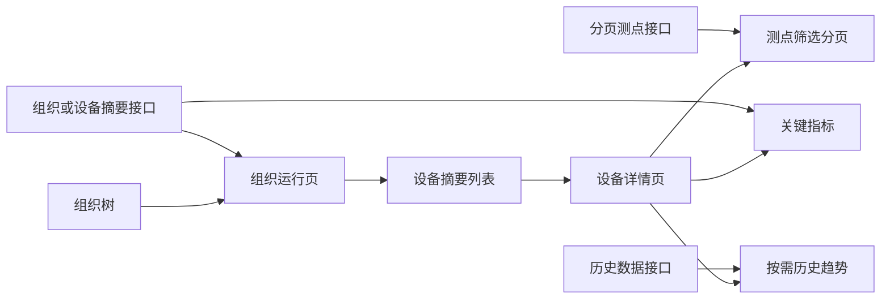

# 组织层级轻量化大屏方案

## 目标
将当前“预生成大量 `device-*` 页面 + 首页承载一次图和静态指标”的设计，调整为三层按需运行态：组织层只展示聚合状态，设备层只展示摘要与关键测点，完整测点通过服务端筛选分页获取。任何页面均不预加载其未展开组织、未选设备或未打开图表的数据与组件。

## 目标架构

## 页面职责与瘦身预算
- 首页：组织运行总览。仅加载根组织的直接子节点、聚合设备数/在线数/告警数、TopN 告警和少量全局 KPI；不渲染设备详情、全量一次图或完整测点表。
- 组织页：仅加载当前组织的直接子组织与设备摘要；设备列表虚拟滚动，进入视口后再渲染卡片。组织树按展开动作懒加载子节点。
- 设备页：首屏仅加载设备身份、通信/在线状态和 6–12 个可用关键指标。测点表必须以“分类 + 搜索 + 服务端分页”为入口；默认首屏一页，切页不可拉取全量点位。
- 趋势图：进入设备页不自动请求历史；仅当用户打开趋势面板并选择测点后加载，切换测点取消过期请求。
- 将预算纳入验收：首屏组件数、首屏 API 数、首屏数据条数、页面配置体积、节点切换时间和测点翻页时间均设为可自动检查的阈值。预算数值在实现前根据现网设备树与浏览器性能采样固化。

| 指标 | 预算 |
|---|---:|
| 测点首屏及翻页行数 | 20 行 |
| 服务端允许的单页测点上限 | 100 行 |
| 设备页关键指标 | 最多 12 项 |
| 单次历史趋势 | 1 条序列、最多 300 点 |
| 组织摘要缓存 | 15 秒 |
| 折叠组织树节点 DOM | 0 个递归子节点实例 |

## 关键实现
1. 在 `ISMRunTreeNav.vue` 与导航上下文链路中，将组织节点展开、设备选择和测点页码明确区分：组织节点只请求子节点；设备选择只创建设备详情上下文；分页只请求当前设备的当前筛选页。
2. 在 `navContextBinding.js` 采用“轻量模板 + navContext 注入”替代每台设备一份完整 cells。保留已验证的名称同步和分页防竞态逻辑，不作无关重构。
3. 在 `ViewRealTable.vue` 接入分类、搜索和服务器返回的 `total/page/pageSize/rows`，用请求序列号取消过期响应；表格只渲染当前页可见行。
4. 在 `ism_server_user` 增加独立的设备测点查询契约：`deviceUuid`、分类、关键字、页码、页大小和排序；由数据库完成筛选/计数/分页，返回当前页测点及总数。现有全量实时接口保持兼容，避免影响其他组件。
5. 为组织摘要、设备摘要、历史趋势建立独立的按需接口与缓存边界：组织摘要短 TTL，设备实时值仅缓存当前设备，趋势按用户触发请求并取消过期响应。
6. 以 `build_ncc_dashboard.py` 生成少量组织与设备轻模板，而非 342 份完整设备页；现有冗余 `device-*` 页面在备份后按目标模型范围迁移或软删除，确保回滚可恢复。
7. 复用 `detail.active` 实时绑定机制；不要以 `dataBind=[]` 判定无绑定。对没有可靠业务测点映射的 KPI/图表显示“未接入”，不显示伪造的 `0`、`---` 或静态趋势。

## 验收
- 组织树逐级展开且只请求当前节点子集；不因根节点存在数百设备而阻塞首屏。
- 选择设备后仅加载该设备摘要；拥有上万点位时，初始请求与 DOM 行数仍受页大小限制。
- 搜索、分类和翻页连续操作不回跳、不抖动，旧请求不得覆盖当前页。
- 打开趋势面板前无历史接口请求；切换设备或测点后不显示旧设备数据。
- 首页、组织页、设备页在浏览器性能采样中满足固化预算，并输出网络瀑布、DOM/组件计数与接口响应验证报告。
- 备份当前模型配置并提供按模型范围恢复命令。
