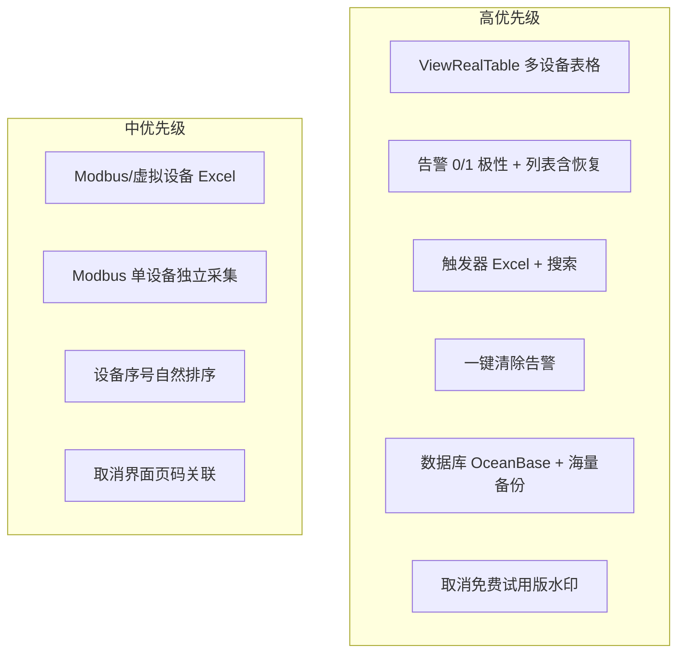
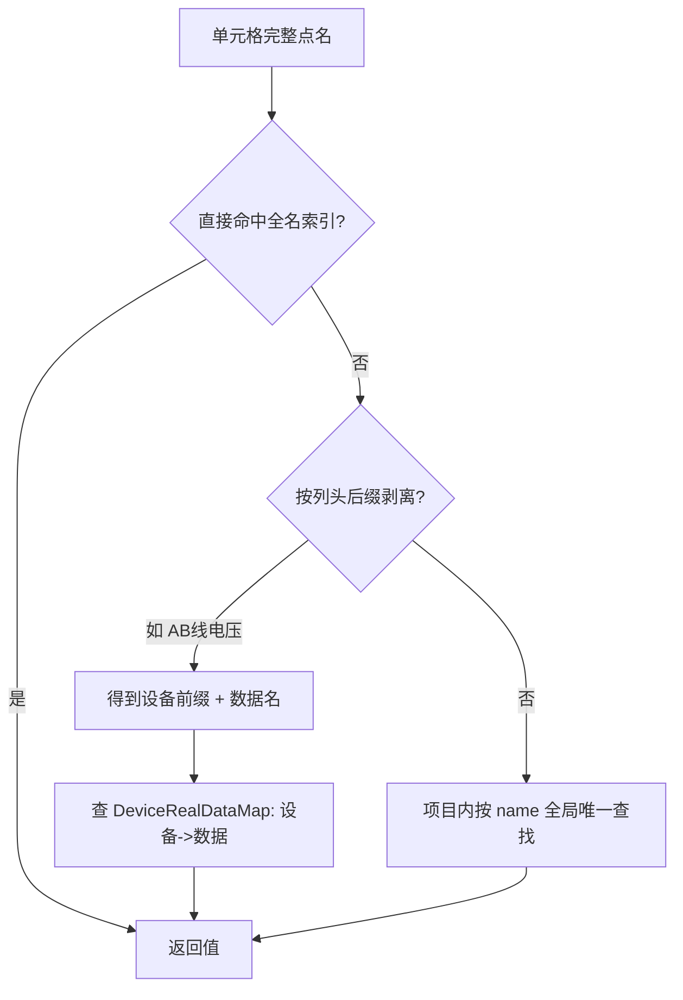
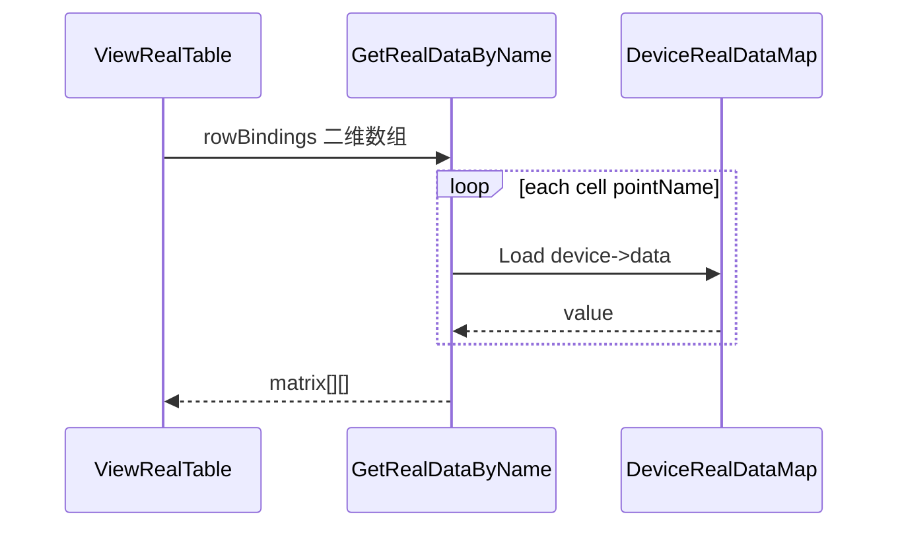
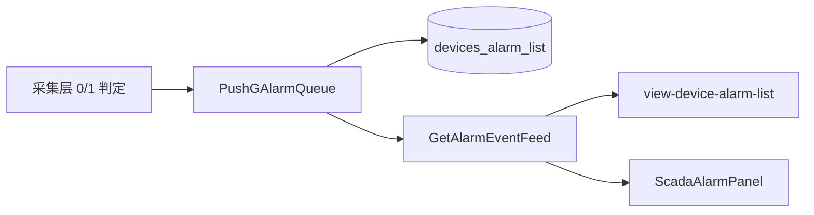
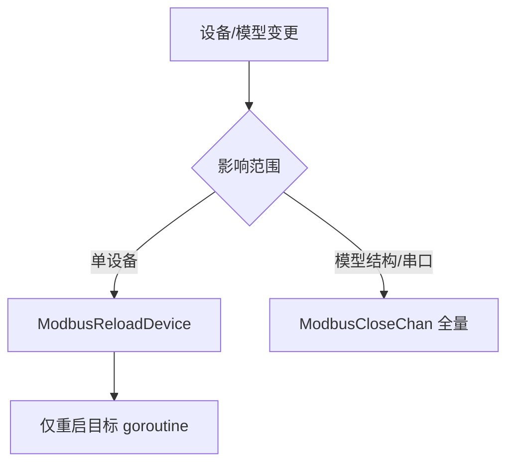

# ISM 软件优化需求分析与开发方案

## 零、进度快照（2026-07-09）

- **默认大屏 1C+2C**：懒加载禁全量回退 + 17→4 页轻量重建 + meta 载荷精简；见 [`ISM-默认大屏-1C-2C全量优化.md`](./ISM-默认大屏-1C-2C全量优化.md) / [`ISM-默认大屏瘦身方案.md`](./ISM-默认大屏瘦身方案.md)
- **待现场**：执行瘦身 SQL、部署含改动的前后端并验收设计页

## 零、进度快照（2026-07-06 晚）

- **Phase1 全部完成**：告警极性/事件流、触发器 Excel、一键清除补丁（含离线补建）、水印关闭
- **Phase2**：`releases/ism-release-oceanbase-20260706.zip` 已构建；Modbus 单设备热更新已接线
- **Phase3**：虚拟设备 Excel、设备 sid 排序、Modbus 分页拆分、隐藏页码关联
- **待验证**：`docker pull oceanbase/oceanbase-ce` + `start-all.sh`；循安 ISMRunTreeNav 浏览器点击

---

## 零、进度快照（2026-07-06）

> 代码库已验证；本节仅增补交付进度，不替代下文设计细节。

### 已完成 ✅

| 项 | 验证要点 |
|----|----------|
| **ism-view-real-table** | `ViewRealTable.vue` 四项 diy（`columnHeaders`/`rowDeviceNames`/`rowDeviceCodes`/`rowBindings`）；`GetRealDataByBindings` + `deviceData.go` 点名解析；路由/i18n；浏览器冒烟通过 |
| **循安数据恢复** | Sqlite3 backup 导入；`rebuild_xunan_dashboard.py`；`homeDashboard.js` 指向循安 UUID（`b8b4c094…` / `3ec5821f…`） |
| **应用管理空列表** | `HOME_PROJECT_UUID` 与循安项目 UUID 对齐，应用列表可正常加载 |
| **远程测试部署** | `ism-release-sqlite-20260706`；端口 **7080/8091**；独立目录隔离 `ism_web`；`deploy_remote_test.sh`、`build_test_release_v2.sh` |
| **控制台修复** | `actions.js` 空 `components` 防护；`routerUtil.js` `dedupRoutesByName` 去重 |
| **ResyncOfflineDeviceAlarms** | `alarmModel.go` 一键清除后为离线设备补建告警（`/AlarmClearAll` 增强） |
| **p1-alarm-polarity** | `alarm_on_value` + Modbus 全链路 + Excel 列 |
| **p1-alarm-feed** | `GetAlarmEventFeed` + `alarmList.vue` 告警/恢复双态 |
| **p1-trigger-excel** | `trigger.vue` Excel/搜索 + `AlarmTriggerImport/Export` |
| **p1-clear-alarm-patch** | 主分支已合入；`PATCH_INFO.txt` 已更新 |
| **p1-watermark** | `setting.config.js` `IsOEM:true` |
| **p2-oceanbase-backup** | `build_oceanbase_release.sh` + `DbManager` 大表提示 |
| **p2-modbus-hotreload** | `ModbusReloadDevice`/`ModbusStopDevice` |
| **p3-mid-priority** | 虚拟设备 Excel、设备 sid 排序、Modbus 分页拆分 |

### 进行中 🟡

| 项 | 现状 | 剩余 |
|----|------|------|
| **p2-oceanbase 联调** | 脚本就绪 | Docker 拉 OB + `dbtype=4` 冒烟 + 完整 zip |
| **alarm-clear-all-v1 重打包** | marker 已更新 | 重编译 ism_server + dist 后打 zip |
| **ISMRunTreeNav** | 部分修复 | 全量浏览器验证 |

### 仍待做 ⏳

- 非 Modbus 协议 `alarm_on_value`（MQTT/OPCUA 等 TODO）
- 远程 8091 全量回归（可选）

### 下一步建议顺序

1. 本机 API curl 冒烟 + `go build`
2. `bash scripts/build_oceanbase_release.sh`（需 Docker）
3. 远程部署 / 补丁 zip 重打

---

## 一、文档需求摘要

文档来自客户现场使用反馈，共 **8 项**（高/中优先级），并约定：**开发完成后先在本机验证，客户提供服务器信息后再部署到现场测试**。



---

## 二、逐项现状与差距

### 1. 应用列表 `ism-view-real-table`（高）— ✅ 已实现（2026-07-06）

> **改动范围锁定**：仅修改组件 **`ism-view-real-table`**  
> 文件：[`ism-front-end-v2/src/pages/ISMDisPlay/ISMComponents/standard/ViewRealTable.vue`](ism-front-end-v2/src/pages/ISMDisPlay/ISMComponents/standard/ViewRealTable.vue)（`name: 'ism-view-real-table'`，第 239 行）  
> **不要改错**以下易混淆组件：
> | 组件名 | 文件 | 用途 |
> |--------|------|------|
> | `view-device-real-data-table` | `ISMComponents/device/RealDataTable.vue` | 设备实时数据滚动板 |
> | `view-data-table` | `ISMComponents/standard/RealDataTable.vue` | 另一套数据表 |
> | `ism-mes-table` | `ISMComponents/Mes/standard/MesTable.vue` | MES 表格 |

#### 1.0 核心差异：数据提供方式变了（用户确认）

**不是表格 UI 问题，是「怎么把绑点数据交给组件」变了。**

| | 旧方式 | 新方式 |
|---|---|---|
| 配置输入 | **两个独立列表**：`deviceList` + `dataList` | **一个数据维度**：`数据列表` 定列 + 每行用 `;` 逐列填点 |
| 点位字符串 | 设备名、数据名分开配置，后端做交叉 | 每格单独填测点名；**设备展示名另配**，不从点位反推 |
| 查值逻辑 | `device[i] × data[j]` 笛卡尔积 | 按行内 `;` 顺序，逐格取**完整点名**对应的实时值 |
| 表头 | 从 dataList 别名推导 | **独立自定义**（①②），与测点点名解耦 |
| 设备名称列 | 从 deviceList 的 `-` 解析 | **每行手动命名**，不从点位字符串解析 |

客户原话要点：**点位字符串里虽可能含设备信息，但各点命名不一致，无法可靠反推设备名** —— 因此 `设备名称`（及可选 `设备编号`）**由用户自行填写**，与 `rowBindings` 按行对齐。

**业务价值（用户确认）**：只有这种数据提供方式，才能真正实现 **「一个表格 → 多台设备 → 每台设备多个数据点」** 的展示。

#### 1.1 客户到底要什么（业务场景）

配电室大屏需要一张**多设备对比表**：每行一台柜/回路（如 Y13_1、Y13_2），每列一种电气量（AB 线电压、BC 线电压、谐波畸变率…），实时刷新数值。

文档示例：

| 行 | 第1列绑定点 | 第2列绑定点 | … | 第N列绑定点 |
|----|------------|------------|---|------------|
| 第1行 | `配电室1A1_U1_Y13_1_AB线电压` | `配电室1A1_U1_Y13_1_BC线电压` | … | `1A1_U1_Y13_1_中性线电流谐波畸变率` |
| 第2行 | `配电室1A1_U1_Y13_2_AB线电压` | `配电室1A1_U1_Y13_2_BC线电压` | … | `配电室1A1_U1_Y13_2_中性线电流谐波畸变率` |

**已确认的配置原则（最新）**：
- **规则矩阵**：每行一台设备，各列不同测点
- **表头 `columnHeaders`**：自定义列名（①②），与绑定点名无关
- **设备名称 `rowDeviceNames`**：每行**手动填写**展示名，不从点位解析（点名里设备信息不一致）
- **设备编号 `rowDeviceCodes`**（可选）：每行手动填写，与设备名称同样自定义
- **行测点 `rowBindings`**：单行文本，**行间 `;`、列间 `,`**；每格可自定义测点，与 `columnHeaders` 列序对齐

#### 1.2 现有组件为什么「不能满足」

组件 [`ViewRealTable.vue`](ism-front-end-v2/src/pages/ISMDisPlay/ISMComponents/standard/ViewRealTable.vue) 当前配置方式：

```
deviceList（逗号分隔）:  设备A-真实名A, 设备B-真实名B
dataList（逗号分隔）:    别名-AB线电压, 别名-BC线电压
```

后端做 **笛卡尔积**：每个设备 × 每个数据类型，用 `设备名->点位名` 查内存 map。

| 问题 | 说明 |
|------|------|
| 命名格式不兼容 | 用 `-` 拆「别名-真实名」，客户点名含 `_`、中文、配电室前缀，一拆就错 |
| 列标题不可独立定制 | 表头 = dataList 的别名部分，无法单独设「①AB线电压」「②BC线电压」 |
| 与客户点名体系不一致 | ISM 内存 key 是 `1A1_U11_S18_1->AB线电压`；客户 Excel 写的是 `配电室1A1_U1_Y13_1_AB线电压` |
| API 未接通 | `GetRealDataByName` 无路由注册，组件调接口会 404 |
| 多设备展示名错位 | 固定列「设备名称/编号」从 deviceList 的 `-` 解析，与客户完整点名对不上 |

本质矛盾：**客户按「完整唯一点名」维护 Excel；组件按「设备列表 + 短数据名」做矩阵乘法。**

#### 1.3 目标表格结构（渲染效果）

```
┌────┬──────────┬──────────────┬──────────┬──────────┬─────────────┐
│序号│ 设备名称  │  设备编号     │ ①AB线电压 │ ②BC线电压 │ ③谐波畸变率  │  ← ①② 自定义
├────┼──────────┼──────────────┼──────────┼──────────┼─────────────┤
│ 1  │ Y13_1    │ 1A1_U1_Y13_1 │  220.5   │  221.0   │   3.2%      │
│ 2  │ Y13_2    │ 1A1_U1_Y13_2 │  219.8   │  220.2   │   2.8%      │
└────┴──────────┴──────────────┴──────────┴──────────┴─────────────┘
```

- **列定义** `columnHeaders`：自定义表头，全表共用
- **行定义** `rowBindings`：每行 `;` 分隔各列测点，按行插入所需点位
- **设备名称** `rowDeviceNames`：**用户自命名**，与 `rowBindings` 按行号一一对应（不解析点位）

#### 1.4 新配置模型（组态编辑器 `diy`）

**四个配置项，按行号对齐（第 N 行 = `rowDeviceNames` 第 N 行 + `rowBindings` 第 N 行）：**

```text
① columnHeaders（逗号分隔，自定义表头，仅显示）:
   ①AB线电压, ②BC线电压, ③中性线电流谐波畸变率

② rowDeviceNames（换行分隔，每行一个，手动命名）:
   1A1进线柜Y13_1
   1A1进线柜Y13_2

③ rowDeviceCodes（换行分隔，可选，手动填写）:
   Y13-1
   Y13-2

④ rowBindings（**行间 `;` 分隔，列间 `,` 分隔**，一行 = 一台设备的各列测点）:
   配电室1A1_U1_Y13_1_AB线电压,配电室1A1_U1_Y13_1_BC线电压,1A1_U1_Y13_1_中性线电流谐波畸变率;配电室1A1_U1_Y13_2_AB线电压,配电室1A1_U1_Y13_2_BC线电压,配电室1A1_U1_Y13_2_中性线电流谐波畸变率

   解析规则：
   - `;` → 换行（第 1 段 = 第 1 行，第 2 段 = 第 2 行 …）
   - `,` → 同行内各列测点（顺序与 columnHeaders 对齐）
```

**数据流：**

```text
【旧】deviceList × dataList → 笛卡尔积
【新】columnHeaders → 表头
      rowDeviceNames[i] → 第 i 行「设备名称」列（纯展示，自定义）
      rowDeviceCodes[i] → 第 i 行「设备编号」列（可选，自定义）
      rowBindings.split(';')[i].split(',') → 第 i 行各列测点 → 后端逐格查实时值
```

**分隔符约定（用户最终确认）**：

| 符号 | 含义 | 示例 |
|------|------|------|
| `,` | 同一行内，相邻列的测点 | `点A,点B,点C` = 一行 3 列 |
| `;` | 不同行之间 | `行1;行2` = 两行设备 |

**校验**：每个 `;` 段的 `,` 分段数须等于 `columnHeaders` 列数；`;` 段数须等于 `rowDeviceNames` 行数。

兼容：旧 `deviceList`/`dataList` 迁移时生成 `rowDeviceNames` + `rowBindings`。

#### 1.5 完整点名 → 实时值 解析策略

ISM 运行时 map 的 key 为 `设备名->数据名`（见 [`deviceData.go`](ism_server_user/task/ISMScript/func/deviceData.go)），与客户「完整点名」需做映射：



实现要点：
1. 启动/首次查询时，为当前项目构建 `fullNameIndex`（可选：`{room}{device}_{dataName}`、`{device}_{dataName}` 多种别名）
2. 规则矩阵下，设备列展示名从**行内第一个点名的公共前缀**或 `rowLabels` 字段取得
3. 新 API `POST /GetRealDataByBindings`：`{ bindings: string[][], columnCount: number }` → 返回二维矩阵
4. 注册路由；修复 `animateType = option.animate.selected || []`

#### 1.6 开发前仍需 1 份现场样例

文档点名与航信导入数据存在前缀差异（`配电室1A1…` vs `1A1_U11_S18_1`）。**开发前向客户要 1 行真实 Excel 点名**，用于校准 `fullNameIndex` 规则，避免上线后全表显示 `-`。

**差距汇总**：配置模型、点名解析、API 路由、animateType fallback。

---

### 2. 报警功能优化（高）

| 子项 | 需求 | 现状 | 差距 |
|------|------|------|------|
| ① 0/1 报警极性 | 可配置「0 报警」或「1 报警」 | [`modbusPthread.go`](ism_server_user/protocol/modbus/modbusPthread.go) 硬编码 `Value=="1"` 为告警 | 缺模型字段 + 各协议采集层极性判断 |
| ② `view-device-alarm-list` | 列表同时展示告警与恢复 | [`alarmList.vue`](ism-front-end-v2/src/pages/ISMDisPlay/ISMComponents/device/alarmList.vue) 调 `GetCurrentAlarmList`，仅 `clear_time < 2007` 的**未消除**告警 | 需事件流 API 或混合查询；`SelectDevice` 未定义 |
| ③ 触发器 Excel + 搜索 | 告警策略/模型触发器支持导入导出与搜索 | 数据模型寄存器页已有 Excel（[`ModbusModelRegister.vue`](ism-front-end-v2/src/pages/dataModel/modbus/ModbusModelRegister.vue)）；[`trigger.vue`](ism-front-end-v2/src/pages/alarm/trigger/trigger.vue) **无** import/export | 触发器页需补齐 |

---

### 3. 实时告警一键清除（高）

**现状：主分支已完成，补丁包待更新**
- 后端：`POST /AlarmClearAll`（[`alarmCtl.go`](ism_server_user/controllers/alarmCtl.go)）
- 增强：`ResyncOfflineDeviceAlarms`（[`alarmModel.go`](ism_server_user/models/alarmModel.go)）— 清除后为仍离线设备补建实时离线告警
- 前端：[`currentAlarm.vue`](ism-front-end-v2/src/pages/alarm/currentAlarm/currentAlarm.vue) 已有按钮
- 补丁包：[`patches/alarm-clear-all-v1/`](patches/alarm-clear-all-v1/)（构建于 2026-06-27，**未含** `ResyncOfflineDeviceAlarms`）

**交付动作**：重打补丁 zip（含离线补建逻辑）；现场旧版需替换 `ism_server` + 前端 dist。

---

### 4. 数据库 20 万点 + OceanBase（高）

**需求**：海量历史数据下备份还原失效；接入 OceanBase。

**现状**：
- OceanBase 已支持：`dbtype=4`（[`models/db.go`](ism_server_user/models/db.go)），迁移脚本 [`scripts/migrate_sqlite_to_oceanbase.py`](scripts/migrate_sqlite_to_oceanbase.py)，文档 [`docs/ISM-OceanBase部署与切换指南.md`](docs/ISM-OceanBase部署与切换指南.md)
- 全库 SQL 备份：[`controllers/dbOpt.go`](ism_server_user/controllers/dbOpt.go) + [`DbManager.vue`](ism-front-end-v2/src/pages/db/DbManager.vue) — 大表易超时/内存爆
- 项目级 JSON 备份：[`scripts/ism_project_backup_core.py`](scripts/ism_project_backup_core.py) — 更适合航信机房场景

**差距**：需明确「配置库」与「历史库」分离策略；恢复流程对 Modbus 采集的暂停/恢复需验证；大表分批导出/导入。

---

### 5. 取消「免费试用版」水印（高）

**现状**：双通道控制
- [`PreviewWatermark.vue`](ism-front-end-v2/src/components/PreviewWatermark.vue)：`IsOEM===false` 时显示
- [`dashboard.vue`](ism-front-end-v2/src/pages/project/dashboard.vue) + [`watermark.js`](ism-front-end-v2/src/utils/watermark.js)

**方案（二选一，建议 A）**：
- **A（推荐）**：为客户环境配置 OEM 授权（`IsOEM=true`），不改代码
- **B**：代码层默认关闭水印（改 `setting.config.js` / 移除 `PreviewWatermark` 挂载）

---

### 6. 数据模型 Excel（中）

| 子项 | 现状 | 差距 |
|------|------|------|
| Modbus 模型点位 | `ModbusModelRegister.vue` 已有 import/export | 可能需补「设备模型列表」级导出；与客户确认是否指导使用现有功能 |
| 虚拟设备 | [`VirtualDeviceDataList.vue`](ism-front-end-v2/src/pages/dataModel/VirtualDevice/VirtualDeviceDataList.vue) **无** Excel | 参照 Modbus 寄存器页复制 `json_fields_cn` + `exportExcelWithStyle` + 导入 API |

---

### 7. Modbus TCP 采集并行（中）

**需求**：维护一台设备不影响其他设备。

**根因**：[`ModbusGatherStart()`](ism_server_user/protocol/modbus/modbusProtocol.go) 为**全局重启循环**；任何模型/设备变更调用 [`ModbusCloseChan()`](ism_server_user/protocol/modbus/modbusProtocol.go)（见 [`modbusDeviceModelCtl.go`](ism_server_user/controllers/modbusDeviceModelCtl.go)、[`deviceLibraryCtl.go`](ism_server_user/controllers/deviceLibraryCtl.go)）会 **关闭全部** Modbus 协程后重建。

**现状**：TCP 每设备一 goroutine 已并行；串口同 COM 口仍同进程轮询（合理）。

**方案**：引入 `ModbusDeviceManager` — 单设备 start/stop/reload，仅影响目标 UUID；全局 `ModbusCloseChan` 保留为「全量重启」兜底。

---

### 8. 设备序号排序（中）

**现状**：[`deviceLibraryModel.go`](ism_server_user/models/deviceLibraryModel.go) `GetAllDevices` 无 `ORDER BY`；[`DeviceTree.vue`](ism-front-end-v2/src/components/deviceTree/DeviceTree.vue) 无前端排序。

**方案**：后端 `ORDER BY sid ASC` 或按名称 `localeCompare numeric`；删除节点后提供「重排序号」可选功能。

---

### 9. 界面页码关联取消（中）

**需求**：数据模型中「组态展示页面」（`configurationPageUUID` ↔ `PageUUID`）导致寄存器配置分页状态串联；切换分页后返回会跳回。

**根因（两处）**：
1. **表格分页对象共享**：[`ModbusModelRegister.vue`](ism-front-end-v2/src/pages/dataModel/modbus/ModbusModelRegister.vue) 寄存器组表与点位表共用同一 `pagination` 对象
2. **组态页关联字段**：各协议 `*ModelDetail.vue` 的 `configurationPageUUID` 与设备下钻联动

**方案**：
- 短期：拆分 `groupPagination` / `dataPagination`，返回列表时 `current = 1`
- 按需求「取消关联」：在数据模型编辑页隐藏/禁用 `configurationPageUUID` 表单项（保留 DB 字段兼容旧数据）

---

## 三、分期开发计划

### Phase 1 — 高优先级可交付（约 2 周）

**目标**：客户可立即感知的核心体验修复。

1. **ViewRealTable 重构** ✅ **已完成**（仅 `ism-view-real-table` / `ViewRealTable.vue`）
   - `columnHeaders`：自定义表头
   - `rowDeviceNames`：每行设备名称（**手动命名，不解析点位**）
   - `rowDeviceCodes`：每行设备编号（可选，手动）
   - `rowBindings`：每行测点，`;` 分隔，与列对齐
   - 新 API `GetRealDataByBindings`：仅对 `rowBindings` 逐格查值
   - 兼容旧配置；注册路由；`animateType` fallback

2. **告警极性 0/1** ⏳ 待做
   - DB：`devices_model_data` / `device_real_data` 增 `alarm_on_value`（0 或 1，默认 1）
   - 前端：寄存器编辑表单增加「报警触发值」下拉
   - 后端：各 `*Pthread.go` 的 `DealWith*AlarmData` 改为 `value == alarmOnValue` 判定
   - Excel 模板增列「报警触发值(0,1)」

3. **告警列表含恢复信息** ⏳ 待做
   - 新 API `GetAlarmEventFeed`：合并未消除告警 + 近 N 条已恢复记录（按 `happen_time`/`clear_time` 排序）
   - `alarmList.vue`：增加「状态」列（告警/恢复），展示 `AlarmMessage` / `AlarmClearMessage`
   - 修复 `SelectDevice`/`SelectAlarmData` 未定义；补 `animateType` fallback

4. **触发器 Excel + 搜索** ⏳ 待做
   - `trigger.vue`：参照 `ModbusModelRegister` 增加导出/导入按钮 + 名称搜索
   - 后端：`AlarmTriggerExport` / `AlarmTriggerImport`（CSV/XLSX）

5. **一键清除告警** 🟡 主分支已完成，补丁包待更新
   - 主分支已含 `/AlarmClearAll` + `ResyncOfflineDeviceAlarms`；重打 [`patches/alarm-clear-all-v1`](patches/alarm-clear-all-v1/)

6. **试用版水印** ⏳ 待做
   - 本机验证：配置 OEM 授权或按客户要求代码关闭

**验证**：本机 `vue-cli-service serve` + `ism_server`；用航信项目数据跑 ViewRealTable 与告警场景。

---

### Phase 2 — 数据库与采集架构（约 2–3 周）— **OceanBase 一体化打包为 P2 重点**

1. **OceanBase 生产切换** 🟡 脚本已写，待 Docker 联调
   - 按 [`docs/ISM-OceanBase部署与切换指南.md`](docs/ISM-OceanBase部署与切换指南.md) 执行
   - `scripts/build_oceanbase_release.sh` + docker-compose + `start-all.sh`
   - `migrate_sqlite_to_oceanbase.py` 全量迁移 + 采集冒烟

2. **海量备份恢复改造** ⏳ 待做
   - 配置表（模型/设备/组态）：继续 SQL 或 JSON 项目备份
   - 历史表（`device_record_*`）：分批导出（按时间窗口 / 设备 UUID），恢复用 `INSERT IGNORE` 批量
   - `DbManager.vue`：大表默认排除、显示预估行数、超时提示
   - 恢复期间 `IsRestoreDb=1` 暂停采集（已有逻辑，需回归测试）

3. **Modbus 单设备热更新** ⏳ 待做
   - 新增 `ModbusReloadDevice(uuid)` / `ModbusStopDevice(uuid)`
   - 改造 `deviceLibraryCtl` / `modbusDeviceModelCtl`：默认调单设备 API，仅结构变更时全量重启
   - 回归：TCP 多从站共享连接、串口多从站轮询

**验证**：20 万点规模下备份/恢复耗时与完整性；单设备启停不影响其他设备采集。

---

### Phase 3 — 中优先级体验（约 1–2 周）

1. **虚拟设备 Excel**：`VirtualDeviceDataList.vue` 对齐 Modbus 导入导出
2. **设备序号排序**：`GetAllDevices` + `DeviceTree` 自然序
3. **页码关联取消**：拆分 pagination + 隐藏 `configurationPageUUID`（各协议 Detail/Add 页）
4. **Modbus 设备模型级 Excel**（若客户确认需要）：`ModbusModel.vue` 批量导出模型元数据

---

## 四、关键技术设计

### ViewRealTable 数据流（新）



### 告警事件流（新）



### Modbus 热更新（新）



---

## 五、本机验证与现场部署

按你的选择：**先本机验证，客户提供服务器后再部署**。

| 阶段 | 动作 |
|------|------|
| 本机开发 | 标准启动流程（`ism_server` + `vue-cli-service serve :7080`） |
| 本机验收 | 按文档 8 项编写测试用例清单，客户远程或录屏确认 |
| 现场部署 | 客户提供服务器信息后：编译 `ism_server` + `npm run build`、打 patch 包、执行 OceanBase 迁移（如需要） |
| 回滚 | 保留 [`patches/`](patches/) 与 [`backups/`](backups/) 基线 |

---

## 六、风险与依赖

- **ViewRealTable**：点位全名规则需与航信 Excel 命名一致（`设备名_点位名` 或 `设备->点位`），开发前抽取 2–3 行真实配置样例
- **告警 0/1 极性**：需同步 modbus/mqtt/opcua/iec104 等所有协议采集层，避免只改 Modbus
- **Modbus 热更新**：改动面大，需充分回归 TCP 共享连接场景
- **OceanBase**：需客户侧 OB 集群就绪；历史数据迁移窗口需业务停机协调
- **水印**：优先 OEM 授权，避免 fork 代码难以合并上游

---

## 八、ism-view-real-table 实现清单（✅ 已实现 2026-07-06）

> 以下改动已合入主分支并通过浏览器冒烟验证。

### 改动文件

| 文件 | 改动 |
|------|------|
| `ism_server_user/task/ISMScript/func/deviceData.go` | `BuildDeviceDataLookupIndex` + `ResolvePointReference` |
| `ism_server_user/controllers/deviceLibraryCtl.go` | `GetRealDataByBindings` |
| `ism_server_user/routers/router.go` | 注册 `/GetRealDataByBindings`、`/GetRealDataByName` |
| `ism-front-end-v2/src/services/api.js` | `GETREALDATABYBINDINGS` |
| `ism-front-end-v2/src/services/device.js` | `GetRealDataByBindings` |
| `ism-front-end-v2/.../ViewRealTable.vue` | 新 diy 四项 + 解析 `,`/`;` + 渲染 |
| `ism-front-end-v2/src/i18n/language.js` | 配置项文案 |

### 配置项（diy key）

- `columnHeaders` — 逗号分隔表头
- `rowDeviceNames` — 换行分隔，自定义设备名称
- `rowDeviceCodes` — 换行分隔，可选设备编号
- `rowBindings` — **行间 `;`，列间 `,`**

### 分隔符

- `,` = 同行各列测点
- `;` = 不同行

### 兼容

- 保留读取旧 `deviceList`/`dataList` 并自动迁移
- `animateType = option.animate.selected || []`

---

## 七、建议优先级排序（执行顺序，2026-07-06 更新）

1. ~~ViewRealTable + API 路由~~ ✅ 已完成
2. **一键清除告警补丁重打**（含 `ResyncOfflineDeviceAlarms`）— 🟡 进行中
3. **OceanBase 一体化打包本机联调** — 🟡 P2 重点
4. 告警列表含恢复 + 0/1 极性
5. 试用版水印关闭
6. 触发器 Excel/搜索
7. Modbus 单设备热更新
8. 虚拟设备 Excel / 序号排序 / 页码关联
