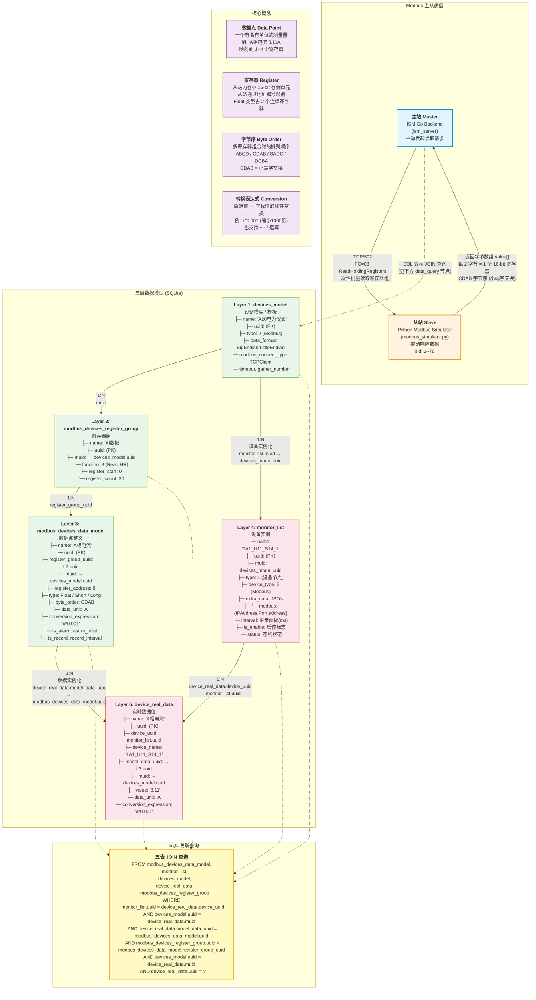
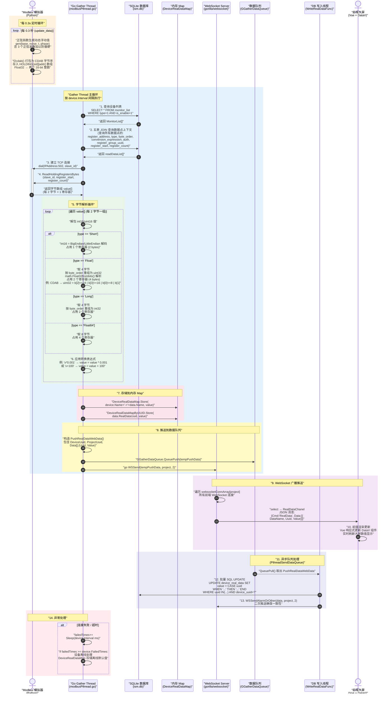

# ISM IoT 数据流全景图

> 从 Modbus 模拟器到前端大屏的完整数据链路，基于 ISM 源码精准绘制。

---

## 一、系统架构概述

ISM 系统的 IoT 数据通路包含五个核心层级：

| 层级 | 组件 | 技术实现 |
|------|------|----------|
| 数据源 | Modbus Simulator / 真实设备 | Python (TCP/502 从站) |
| 采集层 | Go Backend Gather Thread | Go (gomodbus v2) |
| 存储层 | SQLite 数据库 + 内存 Map | GORM + sync.Map |
| 推送层 | WebSocket Server | gorilla/websocket |
| 展示层 | 前端大屏 / 组态编辑器 | Vue + @antv/x6 + DataV |

---

## 二、Diagram 1: 主从关系 + 五层数据模型关系图

### 图1说明

**主从关系**：Go 后端作为 Modbus 主站（Master），通过 TCP/502 端口主动发起 ReadHoldingRegisters（功能码 03）请求；Python 模拟器作为从站（Slave）被动响应，返回字节数组。每个从站用 `sid`（1~76）标识，寄存器数据以 CDAB 字节序（小端字交换）存储。

**五层数据模型**：从设备模板（`devices_model`）到实时数据（`device_real_data`），每一层通过 UUID 外键链式关联。核心关系：一个设备模型模板 → 多个寄存器组 → 多个数据点定义；当模板实例化为具体设备时（`monitor_list`），所有数据点定义也被实例化为对应的实时数据行。

**SQL JOIN 查询**：Gather 线程每次采集前通过五表 JOIN 查询获取完整的数据上下文，包括字节序、数据类型、转换表达式、寄存器地址和寄存器组范围。

---

## 三、Diagram 2: 完整数据链路时序图

### 图2说明

**Step 1-2 (数据生成与准备)**：Python 模拟器每 0.3 秒用正弦函数叠加生成动态数据，用 `f2cdab()` 打包为 CDAB 字节序存入 `HOLDING` 数组。同时 Go gather 线程从 SQLite 查询设备列表和完整数据点上下文（五表 JOIN）。

**Step 3-4 (Modbus 通信)**：Go 后端建立 TCP 连接，用 `ReadHoldingRegistersBytes(slave_id, register_start, register_count)` 批量读取整个寄存器组。模拟器收到请求后从 `HOLDING` 数组中取出对应范围的寄存器值，以字节数组返回。

**Step 5-6 (字节解析)**：遍历字节数组，按数据模型定义的 `type` 和 `byte_order` 解析原始值。Float 类型取 4 字节按 CDAB 等字节序重组为 IEEE 754 浮点数；Short 类型取 2 字节解码。然后应用 `conversion_expression`（如 `x*0.001`）将原始值转换为工程值。

**Step 7-8 (存储与推送)**：解析后的值同时写入两个 `sync.Map`（按 `设备名->数据点名` 和按 `RealDataUuid` 索引），并推入 `GGatherDataQueue` 队列，同时通过 WebSocket 直接推送。

**Step 9-10 (前端渲染)**：WebSocket 服务器遍历该项目的所有前端连接，通过 `RealDataChanel` 发送 JSON 消息。前端 Vue 组件接收到数据后，响应式更新 DataV 大屏组件显示。

**Step 11-13 (异步持久化)**：`PthreadSendDataQueue` 线程从队列中取出数据，用 `CASE WHEN` 批量 SQL 更新 `device_real_data` 表（每 100 条一批），并二次推送确保数据一致性。

**Step 14 (异常处理)**：连接失败时递增 `failedTimes` 计数器，超过阈值则判定设备离线，将离线默认值写入内存 Map。

---

## 四、核心概念详解

### 4.1 数据点 (Data Point)

一个有名有单位的测量量，例如 `"A相电流 8.11A"`。在数据库中映射为 `device_real_data` 表中的一行记录，通过 `model_data_uuid` 关联到 `modbus_devices_data_model` 中的定义。

### 4.2 寄存器 (Register)

从站内存中一个 16-bit 的存储单元。从站通过地址编号（offset，从 0 开始）识别寄存器。

- **Short 类型**：占用 1 个寄存器（2 字节）
- **Float/Long 类型**：占用 2 个连续寄存器（4 字节）
- **Float64/Long64 类型**：占用 4 个连续寄存器（8 字节）

### 4.3 字节序 (Byte Order)

多个寄存器组合成 32/64-bit 值时字节的排列顺序：

| 字节序 | 含义 | 示例 (4 字节为 B0 B1 B2 B3) |
|--------|------|------------------------------|
| ABCD | 大端序 | B0<<24 \| B1<<16 \| B2<<8 \| B3 |
| CDAB | 小端字交换 | B2<<24 \| B3<<16 \| B0<<8 \| B1 |
| BADC | 字内字节交换 | B1<<24 \| B0<<16 \| B3<<8 \| B2 |
| DCBA | 全小端 | B3<<24 \| B2<<16 \| B1<<8 \| B0 |

ISM 模拟器默认使用 **CDAB**（小端字交换）。

### 4.4 转换表达式 (Conversion Expression)

原始值到工程值的线性变换表达式，支持 `+`、`-`、`*`、`/` 四种基本运算。例如：

- `x*0.001` — 原始值缩小 1000 倍（如 mA → A）
- `x+273.15` — 加偏移量
- `x*0.1-40` — 组合运算

---

## 五、文件索引

| 文件 | 功能 |
|------|------|
| `scripts/modbus_simulator.py` | Python Modbus TCP 模拟器 — 76 个从站，0.3s 更新，CDAB 字节序 |
| `ism_server_user/protocol/modbus/modbusPthread.go` | Go 后端 Modbus 采集线程 — 主站逻辑，字节解析，数据推送 |
| `ism_server_user/protocol/modbus/modbusProtocol.go` | Modbus 协议连接管理 |
| `ism_server_user/models/modbusDeviceModel.go` | Modbus 数据模型定义 (Go struct + GORM) |
| `ism_server_user/models/deviceLibraryModel.go` | 设备库模型 — MonitorList, DevicesModel, DeviceRealData |
| `ism_server_user/models/snmpDeviceModel.go` | DeviceRealData struct 定义 |
| `ism_server_user/protocol/common/common.go` | 全局变量 — DeviceRealDataMap, GGatherDataQueue, PushRealDataWebData |
| `ism_server_user/protocol/websocket/websocket.go` | WebSocket 服务器 — 连接管理，数据通道，广播推送 |
| `ism_server_user/task/RealData/dealWithRealData.go` | 数据队列消费 — CASE WHEN 批量 SQL，异步持久化 |
| `ism_server_user/data/db/ism.db` | SQLite 数据库文件 |

---

> 文档生成时间：2026-06-14 | 基于 ISM 源码精确绘制
